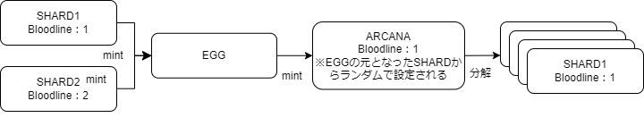

###########################
Bloodline
###########################

概要
============================================
BloodlineとはARCANAが所属する血統であり、全てのARCANAは100の血統(Bloodline)のいずれかに属する。
Bloodlineには始祖があり、始祖のShardからEgg→ARCANA→Shardの循環を経て、下記の図のように継承されている。
新たに生成されるARCANAは、生まれたEGGに使用された2種類のShardのいずれかのBloodlineをランダムに継承する。

情報取得
============================================
Bloodline情報はBloodlineコントラクトを参照することで取得できる。
Bloodlineコントラクトは以下のインタフェースを持つ。

Bloodlineの情報を取得(Bloodline.sol)::

    // 指定したbloodlineのid、名称、所属するARCANA数を返す
    // @param bloodlineID
    // @return origin bloodlineのid
    //         nArcanas 所属するARCANA数
    //         name bloodlineの名称
    function bloodlineInfo(uint256 bloodlineID) public view returns(
        uint256 origin,
        uint256 nArcanas,
        string memory name
    )

ARCANAが属するBloodlineを取得(Bloodline.sol)::

    // getBloodline[arcanaID] でARCANAが所属するbloodlineIDを返す
    // @param arcanaID
    // @return bloodlineID
    function getBloodline (uint256 arcanaID) public view returns(uint256 bloodlineID)

特定のBloodlineに属するARCANAの一覧（既にburnされたARCANAを含む）を取得(Bloodline.sol)::

    // 指定したbloodlineIDに所属するarcanaIDの配列を返す
    // @param bloodlineID
    // @param idx 開始index
    // @param limit 取得数
    // @return uint256[] memory arcanaIDの配列
    function getBelongings(uint256 bloodlineID,uint256 idx, uint256 limit) public view returns(uint256[] memory)

Bloodlineの一覧
============================================

.. csv-table::
    :header-rows: 1
    :align: center

    "id", "名前","出展"
    "1","ヤハウェ (Yahweh)","キリスト教、ユダヤ教"
    "2","ゼウス (Zeus)","ギリシャ神話"
    "3","インドラ (Indra)","ヒンドゥー教"
    "4","アラー (Allah)","イスラム教"
    "5","オーディン (Odin)","北欧神話"
    "6","ブッダ (Buddha)","仏教"
    "7","ヘラクレス (Heracles)","ギリシャ神話"
    "8","ヴィシュヌ (Vishnu)","ヒンドゥー教"
    "9","ヘラ (Hera)","ギリシャ神話"
    "10","ユピテル (Jupiter)","ローマ神話"
    "11","ガネーシャ (Ganesha)","ヒンドゥー教"
    "12","オシリス (Osiris)","古代エジプト神話"
    "13","アポロン (Apollo)","ギリシャ神話"
    "14","マハーカーラ (Mahakala)","ボン教、仏教"
    "15","ハリ (Hari)","ヒンドゥー教"
    "16","ニンフ (Ninhursag)","シュメール神話"
    "17","ペルセポネー (Persephone)","ギリシャ神話"
    "18","ククulkan (Kukulkan)","マヤ神話"
    "19","アヌビス (Anubis)","古代エジプト神話"
    "20","ロキ (Loki)","北欧神話"
    "21","メデューサ (Medusa)","ギリシャ神話"
    "22","クリシュナ (Krishna)","ヒンドゥー教"
    "23","ピシュタクス (Ptah)","古代エジプト神話"
    "24","シヴァ (Shiva)","ヒンドゥー教"
    "25","アテナ (Athena)","ギリシャ神話"
    "26","ディオニュソス (Dionysus)","ギリシャ神話"
    "27","ヴァールナ (Varuna)","ヒンドゥー教"
    "28","イシス (Isis)","古代エジプト神話"
    "29","ティルーンダヴァーユ (Tirunavayi)","タミルの神々"
    "30","ガネーシャ (Ganesha)","ヒンドゥー教"
    "31","セレス (Ceres)","ローマ神話"
    "32","ガネーシャ (Ganesha)","ヒンドゥー教"
    "33","ペレ (Pele)","ハワイアン神話"
    "34","ティワタワカ (Tiwa-tiwa-k'a)","ホピ族の神"
    "35","ペリクレス (Pericles)","ギリシャ神話"
    "36","ユピテル (Jupiter)","ローマ神話"
    "37","グウィネヴィア (Guinevere)","アーサー王伝説"
    "38","アクロポリス (Acropolis)","ギリシャ神話"
    "39","ローマヌス (Romulus)","ローマ神話"
    "40","バルドル (Balder)","北欧神話"
    "41","テスカトリポカ (Tezcatlipoca)","アステカ神話"
    "42","アーマディリョ (Armadillo)","アマゾンの神話"
    "43","クンビラ (Kunbira)","アボリジニの神話"
    "44","イザナミ (Izanami)","日本の神話"
    "45","マアト (Ma'at)","古代エジプト神話"
    "46","ヴァイシュリャ (Vaishravana)","ブッダ教"
    "47","シャクティ (Shakti)","ヒンドゥー教"
    "48","ガラテア (Galatea)","ギリシャ神話"
    "49","ハチマン (Hachiman)","日本の神話"
    "50","ティランギアリンガリ (Tirangirringali)","アボリジニの神話"
    "51","パン (Pan)","ギリシャ神話"
    "52","マヌ (Manu)","ヒンドゥー教"
    "53","ティランティア (Tlaloc)","アステカ神話"
    "54","ヘパイストス (Hephaestus)","ギリシャ神話"
    "55","インタワ (Inti)","インカ神話"
    "56","プトレマイオス (Ptolemy)","ギリシャ神話"
    "57","ヴァユ (Vayu)","ヒンドゥー教"
    "58","グクマッツ (Gucumatz)","マヤ神話"
    "59","フリッグ (Frigg)","北欧神話"
    "60","クンバク (Kumbhak)","シク教"
    "61","ティワ (Tiwa)","ホピ族の神"
    "62","キリスト (Christ)","キリスト教"
    "63","ユグ (Yug)","ヒンドゥー教"
    "64","ワンダナ (Wandana)","アボリジニの神話"
    "65","ヘストィア (Hestia)","ギリシャ神話"
    "66","ガネーシャ (Ganesha)","ヒンドゥー教"
    "67","ハウマイオムイア (Haumia-tiketike)","マオリ族の神"
    "68","マハヤナ (Mahayana)","仏教"
    "69","ゼラス (Zelus)","ギリシャ神話"
    "70","タナロス (Tantalus)","ギリシャ神話"
    "71","ユピテル (Jupiter)","ローマ神話"
    "72","ヴァヤーブ (Vayu)","ヒンドゥー教"
    "73","キウィランギ (Kiwirrkurra)","アボリジニの神話"
    "74","サラスワティ (Saraswati)","ヒンドゥー教"
    "75","ヒロクド (Hirokud)","アイヌ族の神"
    "76","ショーロシ (Shorosh)","ファーシー教"
    "77","オロクン (Olokun)","ヨルバ族の神話"
    "78","アグニ (Agni)","ヒンドゥー教"
    "79","セブ (Seb)","古代エジプト神話"
    "80","カーン (Kan)","マヤ神話"
    "81","クトゥルフ (Cthulhu)","フィクション（H.P. Lovecraft の作品）"
    "82","イザナギ (Izanagi)","日本の神話"
    "83","タウラマオム (Ta'aroa)","ポリネシア神話"
    "84","アヌ (Anu)","シュメール神話"
    "85","プラネート (Planeto)","ローマ神話"
    "96","テュケー (Tyche)","ギリシャ神話"
    "87","ユピテル (Jupiter)","ローマ神話"
    "88","ウラノス (Uranus)","ギリシャ神話"
    "89","ベロナ (Bellona)","ローマ神話"
    "90","マリカリ (Marikari)","アボリジニの神話"
    "91","イシュタル (Ishtar)","バビロニア神話"
    "92","ヒンドロ (Hindro)","ジャワの神話"
    "93","アヌビス (Anubis)","エジプト神話"
    "94","グワーニン・マイン (Gwani'n Myin)","チェロキー族の神話"
    "95","アラケイ (Arak-aye)","アボリジニの神話"
    "96","ウトゥ (Utu)","シュメール神話"
    "97","イリーリュリア (Illyria)","ギリシャ神話"
    "98","ヒカリ (Hikari)","神道"
    "99","ヘカテ (Hecate)","ギリシャ神話"
    "100","ゼウス (Zeus)","ギリシャ神話"

