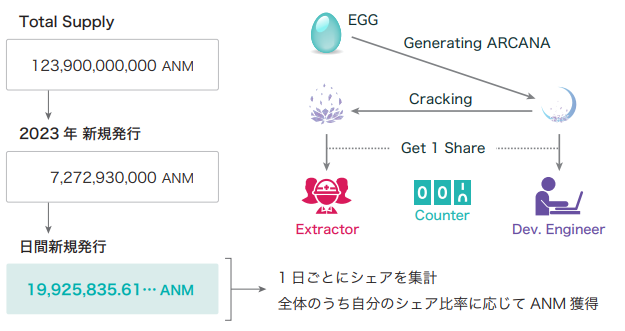

###########################
ANM(Anima)を入手する
###########################

.. attention::

 現在は上場していないため、一般的に入手する方法はありません

--------------------------------

ANIMA（アニマ）とは
==========================
アニカナを利用する為に必要な Gas トークンである。

--------------------------------

ANIMA（アニマ）を Gasとして必要な場面
=============================================

* ANICANA ネットワーク上に MATRIX をブロードキャストするとき
* ANICANA ネットワーク上に EGG を生成するとき
* ANICANA ネットワーク上に PERSONA を生成するとき

--------------------------------

ANIMA の生成ロジック
==========================

* EGG から ARCANA が生成される際、開発エンジニアはシェアを 1 獲得する。
* ARCANA が分解される際、分解エンジニアはシェアを 1 獲得する。
* 1 日ごとに、生成される ANM の総量が決まっている。
* mint される ANM の量は、それぞれが 1 日の間に獲得したシェアによって決定される。

