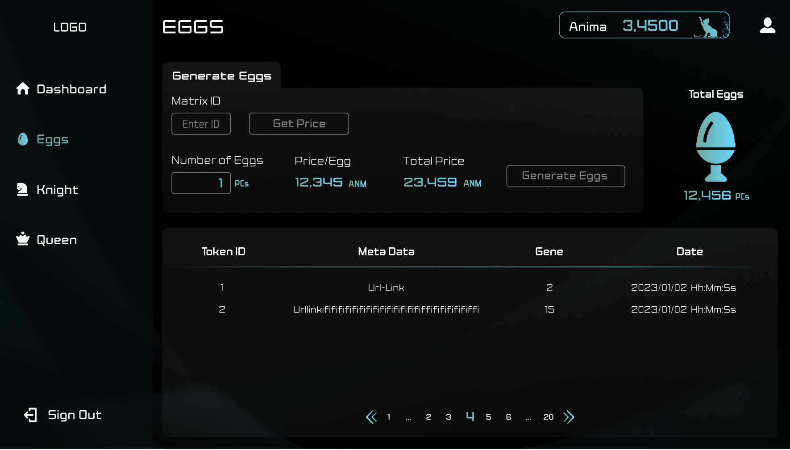
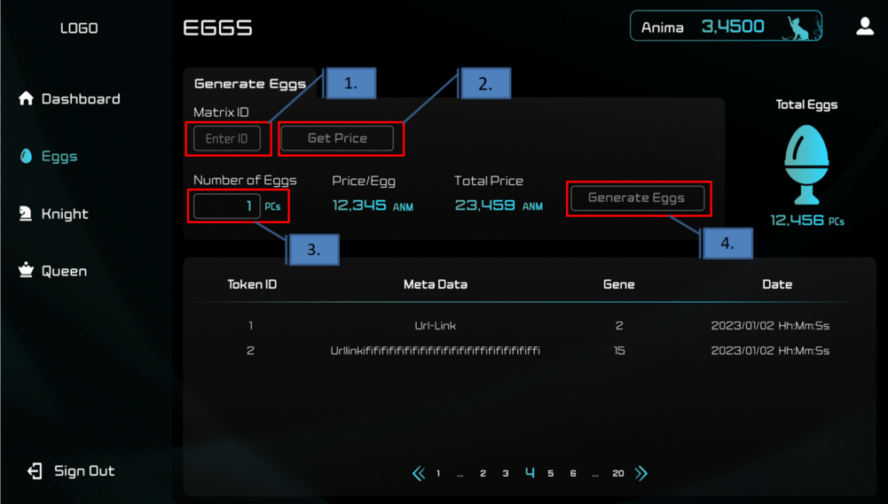

###########################
EGGを生成する
###########################

Validator管理画面内のEGGページで、EGGを生成することができる。
(Validator管理画面はValidatorごとにデプロイされるため、URLは個々の管理者ごとに異なる)

--------------------

生成手順
================

#. MatrixIdの入力 (IDは開発エンジニアから入手)
#. Get PriceでEGG生成コストを取得
#. Number of eggsに生成する個数を入力
#. Generate EggsでEGG生成トランザクションを発行 (Animaを消費する)

