###########################
アフィリエイト機能
###########################

アフィリエイト機能を使用することで、対象サービスからのLevias IDの登録、決済を
reffarrel codeにより追跡することができる。

発行体はサービス登録をアフィリエイト画面上で行い、アフィリエイター等を招待することが出来る。
アフィリエイター等がその製品リンクにreferral codeがついたURLをSNSなどで拡散し、
発行されたURLから登録や決済が行われた数等をアフィリエイト画面上で確認することが出来る。

-----------------------------------------------------------------------------------

導入の流れ-referral codeの発行
=======================================

#. Levias IDアカウントの発行
	* Levias IDアカウントが招待に必要なため、以下より登録を行う。
	* stagingURL:"https://staging.anicana.org/login/idms?f=true"

#. 発行体アカウントの登録
	* 1.で登録したアカウント（以降、発行体アカウントと呼ぶ）で、発行体登録画面よりログイン・登録を行う。
	* ※発行体アカウントの登録用URLは毎回変わるため、ANICANAテクニカルサポートチームに問い合わせてください。

   .. figure:: ../img/affiliate/1.png
      :scale: 30%

#. 発行体アカウントの登録承認
	* ANICANAテクニカルサポートチームで登録内容の承認を行う。
	* 承認後、登録したメールアドレスに承認完了メールが届くため、メールに記載のURLよりログインを行う。

#. 製品登録
	* 承認後、発行体アカウントでログインし、製品登録を行う。
	* ※stagingの場合、画像・URLなどは無ければ適当なものでも可能。

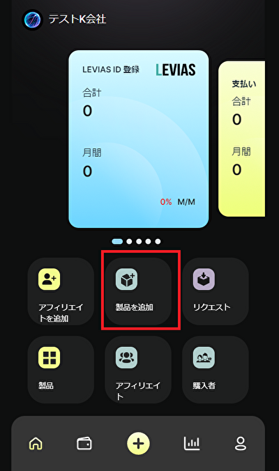
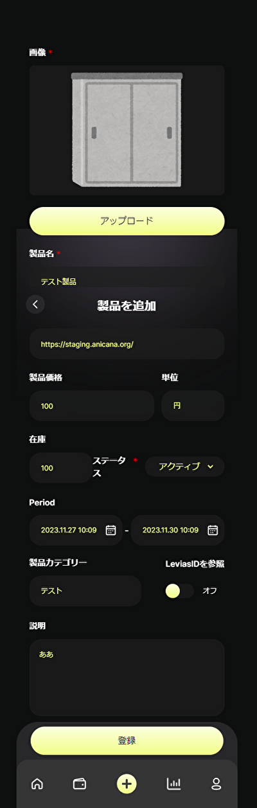
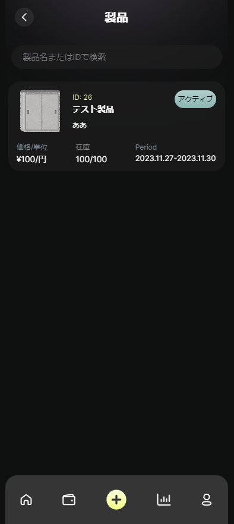

　|affi-img2|　|affi-img3|　|affi-img4|

#. アフィリエイトのリクエスト
	* 製品登録後アフィリエイトを作成する。
	* アフィリエイト用に、別のLevias IDアカウントを作成する。（1.を参照）
	* 発行体アカウントでログインし、アフィリエイト追加画面からアフィリエイト用アカウントに招待を送る。
	* 送付された招待メールから、アフィリエイト用アカウントでログイン・登録を行う。

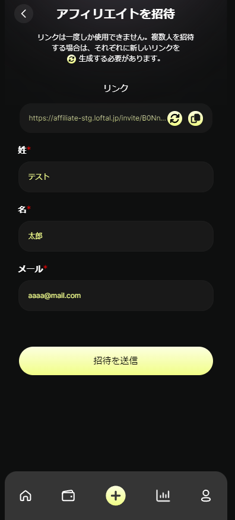
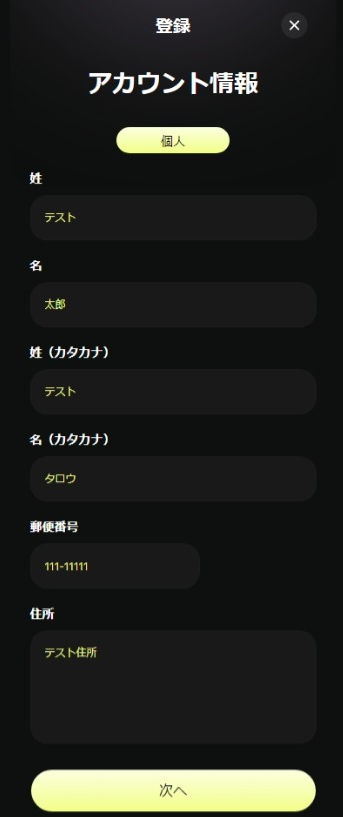
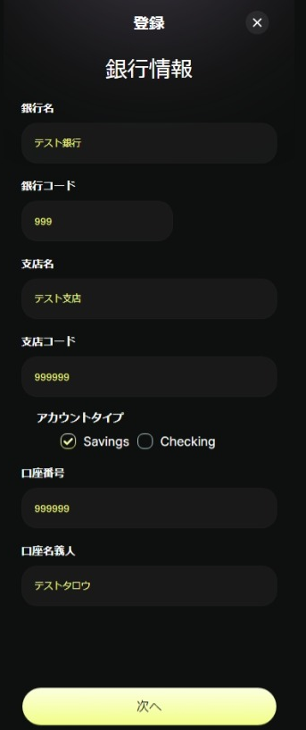

　|affi-img5|　|affi-img6|　|affi-img7|

#. リクエストの承認
	* アフィリエイト登録完了後、発行体アカウントでログインする。リクエストのメニューを押下し、アフィリエイトの承認を行う。

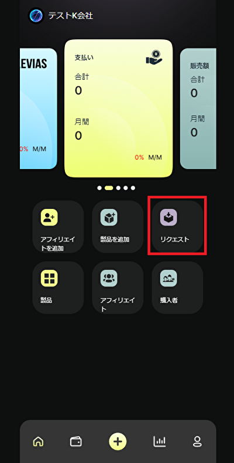
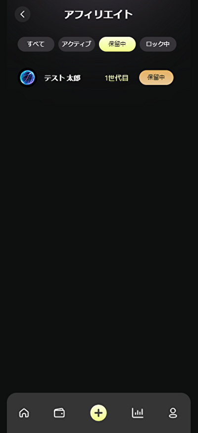
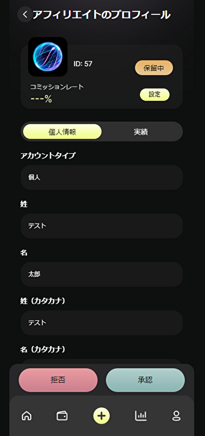
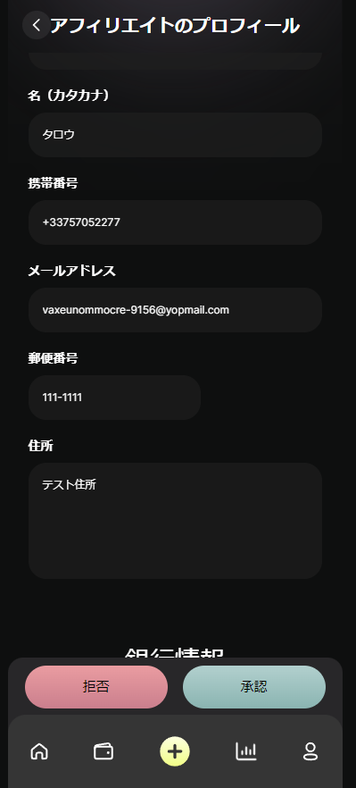
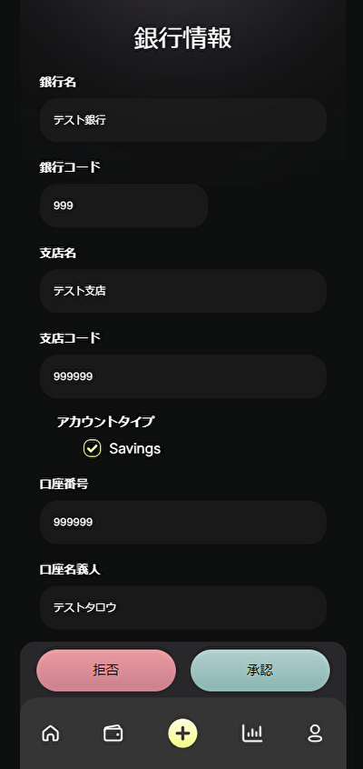

　|affi-img8|　|affi-img9|　|affi-img10|　|affi-img11|　|affi-img12|

#. refarral_codeの発行
	* アフィリエイト用アカウントでログイン、登録した製品を選択し、リンクをコピーする。
	* URLの最後に付いているhashがreferral codeとなる。

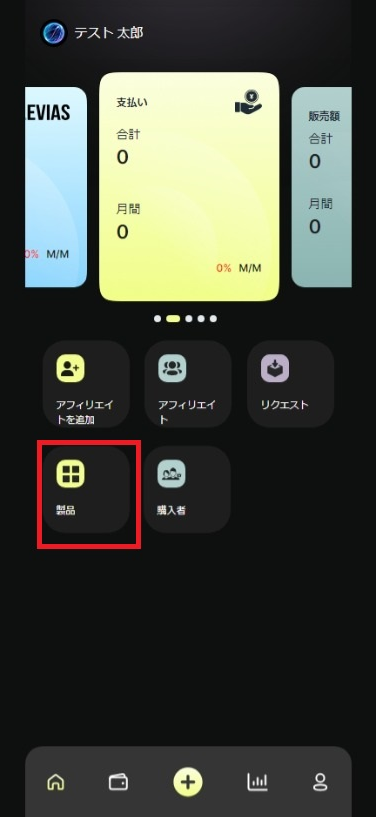
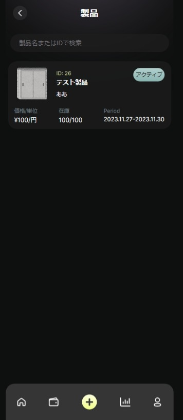
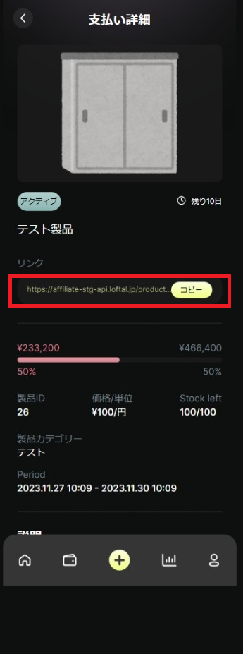

　|affi-img13|　|affi-img14|　|affi-img15|

導入の流れ-refarral_codeの使用
=======================================
Levias IDの登録、決済と紐づけるには登録のURLや決済のRequestに、発行されたreferral codeを付与する必要がある。

| LeviasIDの登録のカウントのために、ログインURL生成でreferral codeを付ける。（カウントされるのはログイン数ではなく、登録数となる）
| `ウォレットの接続  <../game-development/wallet-connection.html>`_ を参照。

| 決済の情報を紐づけるために、LevicaのTransaction RequestAPIに対してreferral codeを付ける。
| `LEVICA決済  <../game-development/levica.html>`_ を参照。

.. admonition:: 集計について

  集計のバッチは１日１回の実行となっているため、決済・登録等の数値は翌日以降に反映される。
