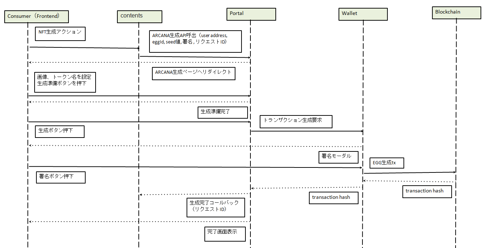

###########################
ARCANA生成手順
###########################

ARCANA生成は、通常はIPFSとANICANA Chainスマートコントラクトとの連携によって行うことができます。

* トークン画像のアップロード(IPFS)
* metadata JSONの生成をアップロード(IPFS)
* EGGの生成と保有
* 保有するEGGをユーザに開封許可する署名生成
* ユーザによるトランザクション署名
* ARCANA生成トランザクションの実行

これらの処理をコンテンツ側が独自に実装するのは煩雑なため、ANICANAポータルがこの処理をサポートするAPIを提供しています。
コンテンツ側は、フロントエンドにスクリプトタグを埋め込み、必要なパラメータを付与するだけで、ユーザをARCANA生成ページに遷移させ、
ARCANA生成を行わせることができます。

ARCANA生成ページ(API)との連携フロー
============================================

