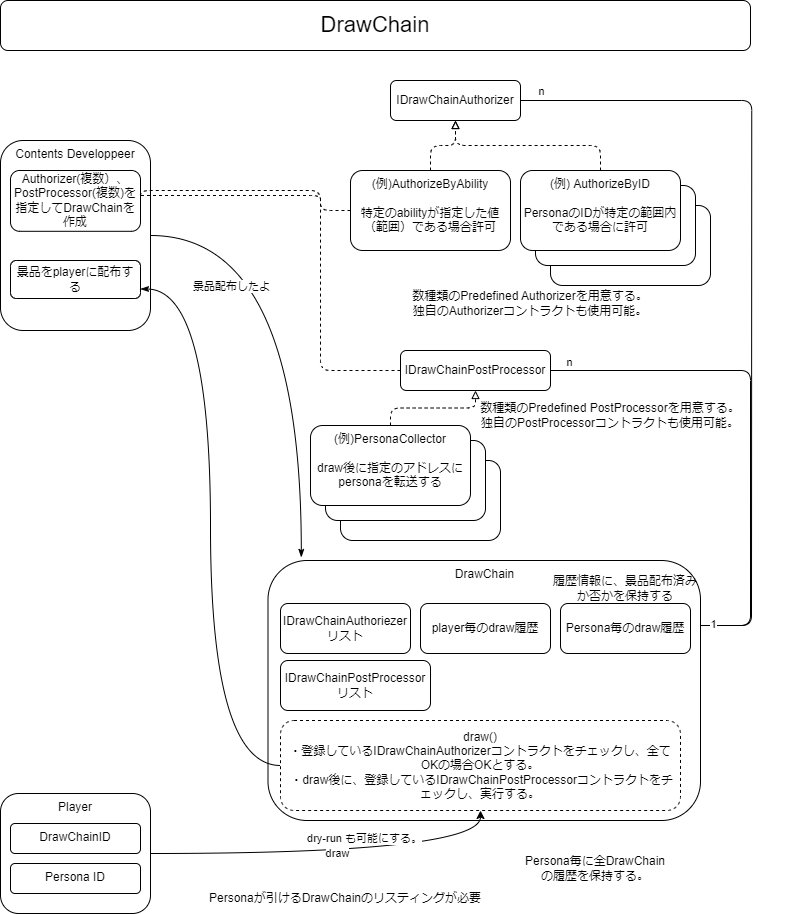

###########################
Drawchainの導入
###########################

概要図
============================================

--------------------------------------------------------------------------------------------------------------------------------

Drawchainの設定
============================================
| Drawchainを実行する際の条件を設定できる。
| IDrawChainAuthorizerインターフェースを継承したコントラクトを登録することで設定が可能。

■パブリッシャー向けfunction

①Drawchainを実行する際の条件を設定するcontractを作成
^^^^^^^^^^^^^^^^^^^^^^^^^^^^^^^^^^^^^^^^^^^^^^^^^^^^^^^^^^

overrideして作成(IDrawChainAuthorizer.sol)::

        @param drawChainId DrawChain ID
        @param presetId プリセット番号（実装コントラクト内で自由に定義する）
        @param personaId persona Id
        authorizeDraw (uint256 drawChainId,uint256 presetId,uint256 personaId) external view returns (bool);

.. csv-table::
    :header-rows: 1
    :align: center

    IF, ダウンロード
    IDrawChainAuthorizer, :download:`IDrawChainAuthorizer.sol<../if/IDrawChainAuthorizer.sol>`

②DrawChainを登録する。
^^^^^^^^^^^^^^^^^^^^^^^^^^^^^^^^^^^^
| 上記で作成したコントラクトをAuthorizerInfoに設定する。
| AuthorizerInfo[]に作成したコントラクトのアドレス、presetIdを設定する。
| presetIdの使用方法は実装コントラクト内で自由に定義することができる。

DrawChainを登録するfunction(Drawchain.sol)::

        @param squareKey drawChainに紐づくSquareKey
        @param _authorizers authorizerのリスト
        @return DrawChain ID
        newDrawChain(uint256 squareKey,AuthorizerInfo[] calldata _authorizers) public returns(uint256)

AuthorizerInfo[]::

        struct AuthorizerInfo {
            @notice IDrawChainAuthorizer コントラクトアドレス
            address authorizer;
            @notice IDrawChainAuthorizer コントラクトのプリセットID
            uint256 presetId;
        }

アクティブ、非アクティブの設定
^^^^^^^^^^^^^^^^^^^^^^^^^^^^^^^^^^^^^^^^^^^^^^

| 初期登録時はtrue: draw可能が設定されている。
| drawChain作成者はdrawの実行を制御可能であり、アクティブ＝true: draw可能、非アクティブ=false: draw不可を変更できる。

DrawChainのアクティブ、非アクティブの設定を行うfunction(Drawchain.sol)::

        @param drawChainId drawChain ID
        @param active true: draw可能、false: draw不可
        function deactivateDrawChain(uint256 drawChainId,bool active)

--------------------------------------------------------------------------------------------------------------------------------

その他Drawchainに関するfunction
============================================

指定したpersonaがdraw可能なdrawChain IDの配列を返す(Drawchain.sol)
^^^^^^^^^^^^^^^^^^^^^^^^^^^^^^^^^^^^^^^^^^^^^^^^^^^^^^^^^^^^^^^^^^^^^^^^^^^^^^^^^^^^^^^^^^^^
::

        @param from 検査対象drawChain 開始ID (inclusive)
        @param until 検査対象drawChain 終了ID (inclusive)
        @param limit 成功するdrawChainがlimitに達したら検索を終了する（返す配列の最大要素数）
        @param personaId drawChainを引くpersonaID
        @return drawが成功する drawChainのID配列
        function availables(uint256 from,uint256 until,uint256 limit,uint256 personaId) public view returns(uint256[] memory) 

※availables()は広い範囲を検索しようとするとgas不足になる可能性があるので注意してください。

DrawChain情報を取得する(Drawchain.sol)
^^^^^^^^^^^^^^^^^^^^^^^^^^^^^^^^^^^^^^^^^^^^^^^^^^^^^^^^^^^^^^^^^^^^^^^^^^^^^^^^^^^^^^^^^^^^
::

        @param fromId 先頭のDrwaChain ID
        @param count 取得するDrawChain情報数
        @return DrawChain情報の配列
        function getDrawChain(uint256 fromId,uint256 count) public view returns(DrawChainInfo[] memory)

DrawChainInfo
^^^^^^^^^^^^^^^^^^^^^^^^^^^^^^^^^^^^^^^^^^^^^^^^^^^^^^^^^^^^^^^^^^^^^^^^^^^^^^^^^^^^^^^^^^^^
::

        struct DrawChainInfo {
            uint256 id;
            uint32 squareKey;
            uint8   active;
            uint8   pad1;
            uint16  pad2;
            uint64  pad3;
            uint128 pad4;
        }

drawChain毎のdraw数（履歴数）を返す(Drawchain.sol)
^^^^^^^^^^^^^^^^^^^^^^^^^^^^^^^^^^^^^^^^^^^^^^^^^^^^^^^^^^^^^^^^^^^^^^^^^^^^^^^^^^^^^^^^^^^^
::

        @param drawChainId DrawChain ID
        function drawHistoryCountByDrawChain(uint256 drawChainId) public view returns(uint256)

drawChain毎のdraw履歴を返す（batch version)(Drawchain.sol)
^^^^^^^^^^^^^^^^^^^^^^^^^^^^^^^^^^^^^^^^^^^^^^^^^^^^^^^^^^^^^^^^^^^^^^^^^^^^^^^^^^^^^^^^^^^^
::

        @param fromIdx 開始index (inclusive)
        @param count 取得するdraw履歴数
        @return draw履歴配列
        function drawHistoryByDrawChain(uint256 drawChainId,uint256 fromIdx,uint256 count) public view returns(History[] memory)

persona毎のdraw数（履歴数）を返す(Drawchain.sol)
^^^^^^^^^^^^^^^^^^^^^^^^^^^^^^^^^^^^^^^^^^^^^^^^^^^^^^^^^^^^^^^^^^^^^^^^^^^^^^^^^^^^^^^^^^^^
::

        @param personaId persona Id
        @return draw数（履歴数）
        function drawHistoryCountByPersona(uint256 personaId) public view returns(uint256)

persona毎のdraw履歴を返す（batch version)(Drawchain.sol)
^^^^^^^^^^^^^^^^^^^^^^^^^^^^^^^^^^^^^^^^^^^^^^^^^^^^^^^^^^^^^^^^^^^^^^^^^^^^^^^^^^^^^^^^^^^^
::

        @param personaId persona Id
        @param fromIdx 開始index (inclusive)
        @param count 取得するdraw履歴数
        @return draw履歴配列
        function drawHistoryByPersona(uint256 personaId,uint256 fromIdx,uint256 count) public view returns(History[] memory)

History
^^^^^^^^^^^^^^^^^^^^^^^^^^^^^^^^^^^^^^^^^^^^^^^^^^^^^^^^^^^^^^^^^^^^^^^^^^^^^^^^^^^^^^^^^^^^
::

        struct History {
            @notice 自身のhistory ID draw()で返す値と同じ
            uint256 id;
            @notice drwaChain Id
            uint256 drawChainId;
            @notice persona Id
            uint256 personaId;
            @notice drawしたタイムスタンプ
            uint128 drawnOn;
            @notice deliver(景品を配布した)したタイムスタンプ
            uint128 deliveredOn;
        }

drawChain+persona毎のdraw数（履歴数）を返す(Drawchain.sol)
^^^^^^^^^^^^^^^^^^^^^^^^^^^^^^^^^^^^^^^^^^^^^^^^^^^^^^^^^^^^^^^^^^^^^^^^^^^^^^^^^^^^^^^^^^^^
::

        @param drawChainId DrawChain ID
        @param personaId persona Id
        @return draw数（履歴数）
        function drawHistoryCountByDrawChainAndPersona(uint256 drawChainId,uint256 personaId) public view returns(uint256)

drawChain+persona毎のdraw履歴を返す（batch version)(Drawchain.sol)
^^^^^^^^^^^^^^^^^^^^^^^^^^^^^^^^^^^^^^^^^^^^^^^^^^^^^^^^^^^^^^^^^^^^^^^^^^^^^^^^^^^^^^^^^^^^
::

        @param drawChainId DrawChain ID
        @param personaId persona Id
        @param fromIdx 開始index (inclusive)
        @param count 取得するdraw履歴数
        @return draw履歴配列
        function drawHistoryByDrawDrawChainAndPersona(uint256 drawChainId,uint256 personaId,uint256 fromIdx,uint256 count) public view returns(History[] memory)

------------------------------------------------------------------------------------------------------------------------------------------------

Drawchainの実行
============================================
| ①DrawChainを引く
| コントラクト：Drawchain

| ■ユーザーが操作時に実行されるfunction

DrawChainを引くfunction(Drawchain.sol)::

        @param drawChainId DrawChain ID
        @param personaId Persona ID
        @return 0：draw失敗。 0以外：historyのindex
        function draw(uint256 drawChainId,uint256 personaId) public returns(uint256)

| ②景品を配布した際にdrawChain作成者に呼び出してもらう
| deliver(景品を配布した)したタイムスタンプを登録。

| ■パブリッシャー向けfunction

タイムスタンプを登録するfunction(Drawchain.sol)::

        @param historyId draw が成功した際に返す history Id
        function delivered(uint256 historyId)

------------------------------------------------------------------------------------------------------------------------------------------------

実装済み IDrawChainAuthorizer
============================================

| 現在利用可能なIDrawChainAuthorizerインターフェースを実装したコントラクトは以下となる。
| 有効にするには、DrawChain登録時のAuthorizerInfoにコントラクトを設定する必要がある。

draw可能な personaの能力値を制限するコントラクト
^^^^^^^^^^^^^^^^^^^^^^^^^^^^^^^^^^^^^^^^^^^^^^^^^^^^^^^^^^^^^^^^^^^^^^^^^^^^^^^^^^^^^^^^^^^^^^^^^^^^^^^^^^^^

| (DrawAbilityLimitter.sol)
| square key ownerにより事前に能力値の制限を設定する必要がある。
| 設定後、DrawChain登録時のAuthorizerInfoにコントラクトを設定する。
| drawするPERSONAの能力値が設定された範囲内である場合、draw可能となる。

登録function::

        @param limit 能力値の制限を設定。Limit[6]はFOR,ABS,DFT,MND,INT,EXPの順となる。
        @return numPresets 登録番号
        function newPreset(Limit[6] calldata limit) public returns(uint256)

変更function::

        @notice presetIdに登録番号を指定。newPreset時のsenderのみ更新が可能。
        @param presetId 登録番号
        @param limit 能力値の制限を設定。Limit[6]はFOR,ABS,DFT,MND,INT,EXPの順となる。
        function alterPreset(uint256 presetId,Limit[6] calldata limit)

値::

        uint256 public numPresets;                      // 登録番号。newPresetでインクリメントされ、自動で振り当てられる。
        mapping(uint256 => Limit[6]) public preset;     // 登録番号と能力値の制限内容をマッピング
        mapping(uint256 => address) public presetOwner; // 登録番号とnewPreset時のsenderをマッピング

Limit::

        struct Limit {
            uint16 min;
            uint16 max;
        }

draw可能なpersona categoryを制限するコントラクト
^^^^^^^^^^^^^^^^^^^^^^^^^^^^^^^^^^^^^^^^^^^^^^^^^^^^^^^^^^^^^^^^^^^^^^^^^^^^^^^^^^^^^^^^^^^^^^^^^^^^^^^^^^^^

| (DrawPersonaCategoryLimitter.sol)
| DrawChain登録時のAuthorizerInfoにコントラクトを設定、presetIdに指定したいカテゴリを設定する。
| drawするPERSONAのpersonaIdに含まれるカテゴリとpresetIdに指定したカテゴリが一致した場合、draw可能となる。

draw可能回数を制限するコントラクト
^^^^^^^^^^^^^^^^^^^^^^^^^^^^^^^^^^^^^^^^^^^^^^^^^^^^^^^^^^^^^^^^^^^^^^^^^^^^^^^^^^^^^^^^^^^^^^^^^^^^^^^^^^^^

| (DrawQuantityLimitter.sol)
| DrawChain登録時のAuthorizerInfoにコントラクトを設定、presetIdにdraw可能回数を設定する。
| drawされた回数が指定したdraw可能回数より小さい場合、draw可能となる。

