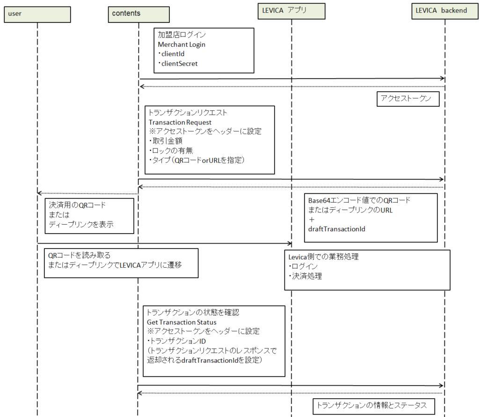

###########################
LEVICA決済
###########################

前払式支払手段で利用できる電子マネーアプリである。
ANICANA ネットワーク上で展開される各種プロダクトおよび連携サービスに対する対価の支払手段（電子マネー）として利用する。

----------------------------------------------------------------------------------------------------------------------------------------------------------------------

API URLフォーマット
=======================================

LEVICA REST APIのURIは、以下の形式となる。::

    ${base_url}/v${version}/${resource}.

.. csv-table::
    :header-rows: 1
    :align: center

    "フィールド", "説明"
    "base_url", "APIがホスティングされているサーバーのURL。また、すべてのAPIにおいて、'base_url'は同じになる。"
    "version", "API のバージョン。"
    "resource", "各APIに付けられた固有の名前。"

----------------------------------------------------------------------------------------------------------------------------------------------------------------------

環境情報
=======================================

各環境情報ページを参照

----------------------------------------------------------------------------------------------------------------------------------------------------------------------

リクエスト認証
=======================================

LEVICAシステムは、RESTfulなフォーマットでデータのやり取りを行う。

* リクエスト認証

REST API を使ってシステムのリソースにアクセスするには、まず加盟店認証を行う必要がある。
認証は、MerchantのclientId,clientSecretを使って行われる。
システムは、認証を実行するためにログインREST APIを提供している。
clientId,clientSecretは、このリクエストとともにシステムに渡される。
システムは、clientId,clientSecretがデータベース内の値と一致するかどうかを比較し、チェックする。
一致した場合、システムは特定の加盟店のアクセストークンを作成し、これらのトークンは認証要求の応答として呼び出し元に返される。
アクセストークンには、必要な加盟店情報が含まれており、これらのアクセストークンは保存する必要がある。
そのため、システムがREST APIリクエストとともにアクセストークンを受け取ると、システムは加盟店認証情報を確認することができる。

パターン１

.. csv-table::
    :header-rows: 1
    :align: center

    "ヘッダーキー", "タイプ", "必須", "説明"
    "Content-Type", "String", "Yes", "リクエストボディのコンテンツタイプ。"
    "Accept", "String", "No", "どのコンテンツタイプであるかを示す。"

パターン２

.. csv-table::
    :header-rows: 1
    :align: center

    "ヘッダーキー", "タイプ", "必須", "説明"
    "Authorization", "String", "Yes", "アクセストークン"
    "Content-Type", "String", "Yes", "リクエストボディのコンテンツタイプ。"
    "Accept", "String", "No", "どのコンテンツタイプであるかを示す。"

| ＊ブラウザの場合、デバイスの種類は必須ではありません。
| ＊APIにファイルアップロードのオプションがある場合、Content-Typeは'multipart/form-data'になります。その他のPOST/PUT APIでは、Content-Typeは'application/json'となります

.. caution:: 
   事前にLEVICAに加盟店登録申請を行い、MerchantのclientId,clientSecretを提供してもらう必要があります。

----------------------------------------------------------------------------------------------------------------------------------------------------------------------

LEVICAとの連携フロー
=======================================

主要なAPI
=======================================
LEVICA決済を導入するために使用する主なAPIを掲載。

* Merchant Login

+-----------------------+------------------------------------------------------------------------------------------------------+
| Request URI           | ${base_url}/$v{version}/merchant/login                                                               |
+-----------------------+------------------------------------------------------------------------------------------------------+
| Method                | post                                                                                                 |
+-----------------------+------------------------------------------------------------------------------------------------------+
| 目的                  | 加盟店としてログインを行う                                                                           |
+-----------------------+------------------------------------------------------------------------------------------------------+
| Request                                                                                                                      |
+-----------------------+------------------------------------------------------------------------------------------------------+
|  Request Header       | | Content-Type: application/json                                                                     |
|                       | | Accept: application/json                                                                           |
+-----------------------+---------------+------------+--------------+----------------------------------------------------------+
|  Request  Parameters  | Field         |  Type      | Required     | 説明                                                     |
|                       +---------------+------------+--------------+----------------------------------------------------------+
|                       | clientId      |  String    | Yes          | | MerchantのclientId                                     |
|                       |               |            |              | | 加盟店がLEVICAに登録された際に、発行元が提供する値     |
|                       +---------------+------------+--------------+----------------------------------------------------------+
|                       | clientSecret  |  String    | Yes          | | MerchantのclientSecret                                 |
|                       |               |            |              | | 加盟店がLEVICAに登録された際に、発行元が提供する値     |
+-----------------------+---------------+------------+--------------+----------------------------------------------------------+
|  Sample request body  | | {                                                                                                  |
|                       | | "clientId": "6779ef20e75817b79602",                                                                |
|                       | | "clientSecret": "GBAyfVL7YWtP6gudLIjbRZV_N0dW4f3xETiIxqtokEAZ6FAsBtgyIq0MpU1uQ7J08xOTO2zwP0OuO3    |
|                       | | pMVAUTid"                                                                                          |
|                       | | }                                                                                                  |
+-----------------------+------------------------------------------------------------------------------------------------------+
| Response                                                                                                                     |
+-----------------------+------------------------------------------------------------------------------------------------------+
|  Success Response     | Http status code: 200                                                                                |
|                       +------------------------------------------------------------------------------------------------------+
|                       | | {                                                                                                  |
|                       | |  "accessToken": {                                                                                  |
|                       | |  "token": "VVNFUl9BQ0NFU1NfVE9LRU4jTVdNMk16Z3hPRFUxTnpNeU1HRXlNVFE1TXpZMU16QTBOMk0yTldWaU9XUm1PVG  |
|                       | |   d6TmpjNFpRPT0jMjAyMi0xMC0yNyAxMTo1Mzo1MS4zNzEjMjAyMi0xMC0yNiAxMTo1Mzo1MS4zNzEjLTg1Mjk1NzkyNA==", |
|                       | |   "expiredAt": "2022-10-27T06:23:51.371+00:00"                                                     |
|                       | |  },                                                                                                |
|                       | |  "merchantId": 33,                                                                                 |
|                       | |  "merchantName": "Merchant Name New s",                                                            |
|                       | |  "callBackUrl": "https://merchanttest.com",                                                        |
|                       | |  "clientId": "1c63818557320a21493653047c65eb9df983678e",                                           |
|                       | |  "address": "0x1563929dcbcaea559734d78a0e864ee680649726"                                           |
|                       | | }                                                                                                  |
+-----------------------+------------------------------------------------------------------------------------------------------+
|  Error Response       | Http status code: 400, Unauthorized                                                                  |
|                       +------------------------------------------------------------------------------------------------------+
|                       | | {                                                                                                  |
|                       | |  "error": "email or password is incorrect"                                                         |
|                       | | }                                                                                                  |
+-----------------------+------------------------------------------------------------------------------------------------------+

* Transaction Request

+-----------------------+------------------------------------------------------------------------------------------------------+
| Request URI           | ${base_url}/$v{version}/merchant/transaction                                                         |
+-----------------------+------------------------------------------------------------------------------------------------------+
| Method                | post                                                                                                 |
+-----------------------+------------------------------------------------------------------------------------------------------+
| 目的                  | トランザクションの開始                                                                               |
+-----------------------+------------------------------------------------------------------------------------------------------+
| Request                                                                                                                      |
+-----------------------+------------------------------------------------------------------------------------------------------+
|  Request Header       | | Content-Type: application/json                                                                     |
|                       | | Accept: application/json                                                                           |
|                       | | Authorization: merchant_access_token                                                               |
+-----------------------+---------------+------------+--------------+----------------------------------------------------------+
|  Request  Parameters  | Field         |  Type      | Required     | 説明                                                     |
|                       +---------------+------------+--------------+----------------------------------------------------------+
|                       | amount        |  Long      | Yes          | 取引金額                                                 |
|                       +---------------+------------+--------------+----------------------------------------------------------+
|                       | isLock        |  byte      | No           | | 0 : ロックなし（初期設定）                             |
|                       |               |            |              | | 1 : ロック                                             |
|                       +---------------+------------+--------------+----------------------------------------------------------+
|                       | type          |  byte      | Yes          | | 1 : QRコードを生成する                                 |
|                       |               |            |              | | 2 : ディープリンクのURLを生成する                      |
+-----------------------+---------------+------------+--------------+----------------------------------------------------------+
|  Sample request body  | | {                                                                                                  |
|                       | |  "amount": 10000,                                                                                  |
|                       | |  "isLock": 1,                                                                                      |
|                       | |  "type": 1                                                                                         |
|                       | | }                                                                                                  |
+-----------------------+------------------------------------------------------------------------------------------------------+
| Response                                                                                                                     |
+-----------------------+------------------------------------------------------------------------------------------------------+
|  Success Response     | Http status code: 200                                                                                |
|                       +------------------------------------------------------------------------------------------------------+
|                       | | ・type=1                                                                                           |
|                       | | {                                                                                                  |
|                       | |   "type" : 1,                                                                                      |
|                       | |   "hasLock" : 1,                                                                                   |
|                       | |   "data" : "<Base64_Encoded_String>",                                                              |
|                       | |   "draftTransactionId" : "D102656693ac3ca6e0cdafbfe89ab99",                                        |
|                       | |   "value" :"<Deep Link URI>",                                                                      |
|                       | |   "createdDate" : "2022-09-1T18:25"                                                                |
|                       | | }                                                                                                  |
|                       | |                                                                                                    |
|                       | | QR code in Base64 Encoded Value                                                                    |
|                       | | //base64値をデコードすることで、画像形式のQRコードが提供される                                     |
|                       | |                                                                                                    |
|                       | | ・type=2                                                                                           |
|                       | | {                                                                                                  |
|                       | |   "type" : 2,                                                                                      |
|                       | |   "hasLock" : 1,                                                                                   |
|                       | |   "data" : "<Web-URI-to-make-payment>",                                                            |
|                       | |   "draftTransactionId" : "D102656693ac3ca6e0cdafbfe89ab99",                                        |
|                       | |   "value" : null,                                                                                  |
|                       | |   "createdDate" : "2022-09-1T18:25"                                                                |
|                       | | }                                                                                                  |
+-----------------------+------------------------------------------------------------------------------------------------------+
|  Error Response       | Http status code: 401, Unauthorized                                                                  |
|                       +------------------------------------------------------------------------------------------------------+
|                       |  | {                                                                                                 |
|                       |  | "message": "Invalid access token",                                                                |
|                       |  | "code": "6001"                                                                                    |
|                       |  | }                                                                                                 |
|                       +------------------------------------------------------------------------------------------------------+
|                       | Http status code: 400, Bad Request                                                                   |
|                       +------------------------------------------------------------------------------------------------------+
|                       |  | {                                                                                                 |
|                       |  | "message": "Amount should be greater than zero",                                                  |
|                       |  | "code": "1003"                                                                                    |
|                       |  | }                                                                                                 |
|                       +------------------------------------------------------------------------------------------------------+
|                       | Http status code: 400, Bad Request                                                                   |
|                       +------------------------------------------------------------------------------------------------------+
|                       |  | {                                                                                                 |
|                       |  | "message": "Invalid Lock status",                                                                 |
|                       |  | "code": "1002"                                                                                    |
|                       |  | }                                                                                                 |
|                       +------------------------------------------------------------------------------------------------------+
|                       |  | {                                                                                                 |
|                       |  | "message": "Invalid Payment type",                                                                |
|                       |  | "code": "1001"                                                                                    |
|                       |  | }                                                                                                 |
|                       +------------------------------------------------------------------------------------------------------+
|                       | Http status code: 404, Not Found                                                                     |
|                       +------------------------------------------------------------------------------------------------------+
|                       |  | {                                                                                                 |
|                       |  | "message": "Merchant Address not found",                                                          |
|                       |  | "code": "2005"                                                                                    |
|                       |  | }                                                                                                 |
|                       +------------------------------------------------------------------------------------------------------+
|                       | Http status code: 400, Bad Request                                                                   |
|                       +------------------------------------------------------------------------------------------------------+
|                       |  | {                                                                                                 |
|                       |  | "message": "No user found",                                                                       |
|                       |  | "code": "1005"                                                                                    |
|                       |  | }                                                                                                 |
+-----------------------+------------------------------------------------------------------------------------------------------+

* Get Transaction Status

+-----------------------+------------------------------------------------------------------------------------------------------+
| Request URI           | ${base_url}/$v{version}/merchant/transaction/{transactionID}/status                                  |
+-----------------------+------------------------------------------------------------------------------------------------------+
| Method                | get                                                                                                  |
+-----------------------+------------------------------------------------------------------------------------------------------+
| 目的                  | トランザクションの状態を取得                                                                         |
+-----------------------+------------------------------------------------------------------------------------------------------+
| Request                                                                                                                      |
+-----------------------+------------------------------------------------------------------------------------------------------+
|  Request Header       | | Content-Type: application/json                                                                     |
|                       | | Accept: application/json                                                                           |
|                       | | Authorization: merchant_access_token                                                               |
+-----------------------+---------------+------------+--------------+----------------------------------------------------------+
|  Request  Parameters  | Field         |  Type      | Required     | 説明                                                     |
|                       +---------------+------------+--------------+----------------------------------------------------------+
|                       | transactionID |  String    | Yes          | TransactionRequestAPIから取得したDraft-TransactionID     |
+-----------------------+---------------+------------+--------------+----------------------------------------------------------+
|  Sample request body  | Empty                                                                                                |
+-----------------------+------------------------------------------------------------------------------------------------------+
| Response                                                                                                                     |
+-----------------------+------------------------------------------------------------------------------------------------------+
|  Success Response     | Http status code: 200                                                                                |
|                       +------------------------------------------------------------------------------------------------------+
|                       | | {                                                                                                  |
|                       | |  "tempTransactionID":  "D5a321108871ea447db69a56404ad65ae46d0073bc68fa91fc60f579f8305ec4b",        |
|                       | |   "transactionId": "4833ea425b55599d97dd700878e0c3a4bf5e276e70edb8636344aa434447bd56",             |
|                       | |   "isLock": 1,                                                                                     |
|                       | |   "type": 1,                                                                                       |
|                       | |   "status": 3, // 1 => pending, 2 => Payment completed, 3=> Transaction completed successfully,    |
|                       | |                   4=> transaction fail, 5=> transaction canceled.                                  |
|                       | |                   ステータス情報について、欄外で補足あり                                           |
|                       | |   "amount": "500",                                                                                 |
|                       | |   "fromAddress": "0x5J3mBbAH58CpQ3Y5RNJpUKP",                                                      |
|                       | |   "toAddress": "0xPKUpJNR5Y3QpC85HAbBm3J5",                                                        |
|                       | |   "transactionCreateDate": "2022-08-16T09:21:49.000+00:00",                                        |
|                       | |   "transactionPaymentDate": "2022-08-16T10:21:49.000+00:00",                                       |
|                       | |   "transactionCompleteDate": "2022-08-17T09:21:49.000+00:00"                                       |
|                       | | }                                                                                                  |
+-----------------------+------------------------------------------------------------------------------------------------------+
|  Error Response       | Http status code: 401, Unauthorized                                                                  |
|                       +------------------------------------------------------------------------------------------------------+
|                       |  | {                                                                                                 |
|                       |  | "message": "Invalid access token",                                                                |
|                       |  | "code": "6001"                                                                                    |
|                       |  | }                                                                                                 |
|                       +------------------------------------------------------------------------------------------------------+
|                       | Http status code: 404,  Not Found                                                                    |
|                       +------------------------------------------------------------------------------------------------------+
|                       |  | {                                                                                                 |
|                       |  | "message": "No transaction found",                                                                |
|                       |  | "code": "1006"                                                                                    |
|                       |  | }                                                                                                 |
+-----------------------+------------------------------------------------------------------------------------------------------+

※statusは2以上であれば、決済完了と判断してよい。4,5が返却されてもブロックチェーンレベルの内容のため、ゲーム側では問題なしと判断してよい。

----------------------------------------------------------------------------------------------------------------------------------------------------------------------

ステージング環境でのテストについて
=======================================
ステージング環境ではテストカード番号を使用することにより、残高をチャージしテストを行うことができます。
決済システムはstripeを使用しているため、以下のカード番号が使用できます。

.. csv-table::
    :header-rows: 1
    :align: center

    "カード会社","カード番号", "有効期限", "セキュリティーコード", "その他のフォームフィールド "
    "Visa", "4242 4242 4242 4242", "有効な将来の日付", "任意の 3 桁のセキュリティーコード", "任意の値 "
    "Visa (デビット)", "4000 0566 5566 5556", "有効な将来の日付", "任意の 3 桁のセキュリティーコード", "任意の値 "
    "Mastercard", "5555 5555 5555 4444", "有効な将来の日付", "任意の 3 桁のセキュリティーコード", "任意の値 "
    "Mastercard (デビット)", "5200 8282 8282 8210", "有効な将来の日付", "任意の 3 桁のセキュリティーコード", "任意の値 "
    "Mastercard (プリペイド)", "5105 1051 0510 5100", "有効な将来の日付", "任意の 3 桁のセキュリティーコード", "任意の値 "
    "American Express", "3782 822463 10005", "有効な将来の日付", "任意の 4 桁のセキュリティーコード", "任意の値 "
