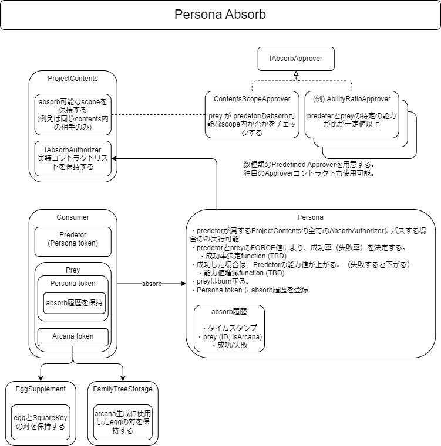

###########################
吸収（Absorb）
###########################

概要図
============================================

--------------------------------------------------------------------------------------------------------------------------------

吸収（Absorb）条件の設定
============================================

PERSONAの吸収対象はパブリッシャー側で設定することが可能。（無制限も設定可能）

------------------------------------------------------------------------
前提条件
------------------------------------------------------------------------
| 前提条件を満たさない場合はrevertする。
| ・predetor(PERSONA) は function を呼び出すアドレスが所有していなければならない。
| ・AbsorbAuthority によって許可された predetor(PERSONA), prey(ARCANA) の組み合わせでなければならない。

------------------------------------------------------------------------
absorb()の実行可否を制限する方法
------------------------------------------------------------------------
| 前提条件で述べたように absorb() は AbsorbAuthorityによって許可された predetor, prey の組み合わせでなければならない。
| absorbの実行可否を制限するには AbsorbAuthorityの設定が必要である。
| AbsorbAuthorityはPredetorのPERSONA category毎に、複数のIAbsorbApproverインターフェースを継承したコントラクトを下記functionで操作可能である。
| 下記functionは numAbsorbApproversを除き、square keyのオーナーのみが操作可能である。

| 手順としては以下のようになる。

①absorbの実行可否を制限するcontractを作成
^^^^^^^^^^^^^^^^^^^^^^^^^^^^^^^^^^^^^^^^^^^^^^

IAbsorbApproverインターフェースを実装したコントラクトを作成する(IAbsorbApprover.sol)::

        @param presetId プリセット番号（実装コントラクト内で自由に定義する）
        @param predetor absorbする側のPERSONA Id
        @param prey absorbされる側のPERSONA Id
        @return true: absorb可、false: absorb不可
        function approveAbsorb(uint256 presetId,uint256 predetor,uint256 prey) external view returns (bool)

インターフェースファイルは環境情報を参照。

②作成したコントラクトを登録
^^^^^^^^^^^^^^^^^^^^^^^^^^^^^^^^^^^^^^^^^^^^^^

コントラクトを登録するfunction(AbsorbAuthority.sol)::

        @param contentsId コンテンツID（contentsId & SquareKey）
        @param contractAddr IAbsorbApproverを継承したコントラクトアドレス
        @param presetId contractAddrのpresetId、preset Idの利用方法法はIAbsorbApproverの実装コントラクトに依存する。
        @return 登録したコンテンツID毎のAbsorbApprover配列のindex
        function addAbsorbApprover(uint32 contentsId,address contractAddr,uint256 presetId) public returns (uint256)

------------------------------------------------------------------------------------------------------------------------------------------------

------------------------------------------------------------------------
その他absorbの条件の設定に関するfunction
------------------------------------------------------------------------

登録したApproverInfoを削除する(AbsorbAuthority.sol)
^^^^^^^^^^^^^^^^^^^^^^^^^^^^^^^^^^^^^^^^^^^^^^^^^^^^^^^^^^^^^^^^^^^^^^^^^^^^^^^^^^^^^^^^^^^^
::

        @param contentsId コンテンツID（contentsId & SquareKey）
        @param idx コンテンツID毎のAbsorbApprover配列のindex
        function removeApprover(uint32 contentsId,uint256 idx)

登録したApproverInfoの置き換えをする(AbsorbAuthority.sol)
^^^^^^^^^^^^^^^^^^^^^^^^^^^^^^^^^^^^^^^^^^^^^^^^^^^^^^^^^^^^^^^^^^^^^^^^^^^^^^^^^^^^^^^^^^^^
::

        @param contentsId コンテンツID（contentsId & SquareKey）
        @param idx コンテンツID毎のAbsorbApprover配列のindex
        @param contractAddr IAbsorbApproverを継承したコントラクトアドレス
        @param presetId contractAddrのpresetId、preset Idの利用方法法はIAbsorbApproverの実装コントラクトに依存する。
        function replaceApprover(uint32 contentsId,uint256 idx,address contractAddr,uint256 presetId)

コンテンツID毎の登録したApproverInfoの登録数を返す(AbsorbAuthority.sol)
^^^^^^^^^^^^^^^^^^^^^^^^^^^^^^^^^^^^^^^^^^^^^^^^^^^^^^^^^^^^^^^^^^^^^^^^^^^^^^^^^^^^^^^^^^^^
::

        @param contentsId コンテンツID（contentsId & SquareKey）
        @return コンテンツID毎のAbsorbApproverの登録数
        function numAbsorbApprovers(uint32 contentsId) public view returns (uint256)

コンテンツ毎のAbsorbApproverリスト(AbsorbAuthority.sol)
^^^^^^^^^^^^^^^^^^^^^^^^^^^^^^^^^^^^^^^^^^^^^^^^^^^^^^^^^^^^^^^^^^^^^^^^^^^^^^^^^^^^^^^^^^^^
::

        @notice approverList(contentsId)で取得可能
        mapping(uint32 => ApproverInfo[]) public approverList;

ApproverInfo
^^^^^^^^^^^^^^^^^^^^^^^^^^^^^^^^^^^^^^^^^^^^^^^^^^^^^^^^^^^^^^^^^^^^^^^^^^^^^^^^^^^^^^^^^^^^
::

        struct ApproverInfo {
            @notice AbsorbAprover コントラクトアドレス
            address approver;
            @notice 使用するAbsorbAprover コントラクトのプリセットID
            uint256 presetId;
        }

arcanaIdからSquareKeyを取得する(EggSupplement.sol)
^^^^^^^^^^^^^^^^^^^^^^^^^^^^^^^^^^^^^^^^^^^^^^^^^^^^^^^^^^^^^^^^^^^^^^^^^^^^^^^^^^^^^^^^^^^^
::

        @param arcanaId ARCANAのトークンID
        @return arcanaIdに紐付いたSquareKey
        function arcanaToSquareKey(uint256 arcanaId) external view returns (uint256) 

------------------------------------------------------------------------------------------------------------------------------------------------

------------------------------------------------------------------------
実装済み IAbsorbApprover
------------------------------------------------------------------------
| 現在利用可能なIAbsorbApproverインターフェースを実装したコントラクトは以下となる。
| 有効にするには、addAbsorbApprover()でAbsorbAuthorityにコントラクトを登録する必要がある。

square keyにより制限するコントラクト
^^^^^^^^^^^^^^^^^^^^^^^^^^^^^^^^^^^^^^^^^^^^^^^^^^^^^^^^^^^^^^^^^^^^^^^^^^^^^^^^^^^^^^^^^^^^^^^^^^^^^^^^^^^^

| (ContentsScopeApprover.sol)
| PERSONAとARCANAが紐づくsquare keyによりabsorb可能・不可能を制限するコントラクト。
| predetorContentsで指定されたPERSONA categoryのPERSONA は preyContentsで指定したcategoryの ARCANAだけを捕食できる。
| ContentsScopeApproverによる捕食制限を有効にするには、以下のfunctionで制限を追加し、AbsorbAuthorityにコントラクトを登録する必要がある。

ContentsScopeApproverに制限を追加するには、以下のfunctionを使用する。::

        @notice contents毎の absorb 可否リストをセットする
        @param predetorContents 捕食者（PersonaId）
        @param preyContents     被食者（ArcanaId）
        @param mask             0xffff0000 (下位16ビットは未使用)
        @param arc              常に true とし0を設定
        function setAbsorbScope(uint32 predetorContents,uint32 preyContents,uint32 mask,uint8  arc) public;

再実行の時間制制限をするコントラクト
^^^^^^^^^^^^^^^^^^^^^^^^^^^^^^^^^^^^^^^^^^^^^^^^^^^^^^^^^^^^^^^^^^^^^^^^^^^^^^^^^^^^^^^^^^^^^^^^^^^^^^^^^^^^

| (AbsorbIntervalApprover.sol)
| 直前のabsorbから一定期間経過しないとabsorbを実行できなくするコントラクト。
| AbsorbAuthorityにコントラクトを登録する際のpresetIdに再absorb可能な時間を設定する。単位はミリ秒単位。

