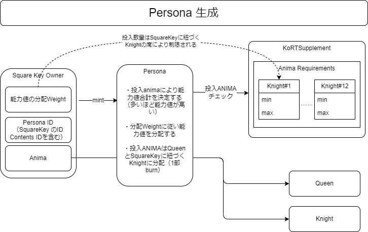
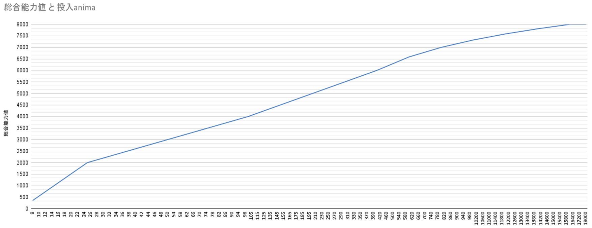

###########################
PERSONAの生成・配布
###########################

概要図
============================================

--------------------------------------------------------------------------------------------------------------------------------

PERSONAの生成
============================================
| PERSONAの生成にはANIMAを消費する。初期能力値はmint時に投入するANIMAの量を基に決定される。投入量が多いほど、能力値の合計が高くなる。
| 投入量は自身が所属するKnightの席番に設定されている範囲内で設定が可能。
| FORCE以外の能力値の分配割合は、パブリッシャーで決定できる。FORCEについては固定割合となる。

----------------------------------------------------------------------------------------------------------------------------------------------------------------------------------------------------------------------------------------------------------------

吸収（Absorb）
============================================
`こちら <../game-development/persona-absorb.html>`__ を参照

--------------------------------------------------------------------------------------------------------------------------------

PERSONA コントラクト
=============================================================

■パブリッシャー向けfunction

PERSONAの生成(Persona.sol)
^^^^^^^^^^^^^^^^^^^^^^^^^^^^^^^^^^^^^^^^^^^^^^^^^^^^^^^^^^^^^^^^^^^^^^^^^^^^^^^^^^^^^^^^^^^^
::

         @param to PERSONAの生成先アドレス
         @param fromId mintする PersonaのID部の開始値。生成するPersonaのIDは以下の構造を持つ256bitデータ
         生成するpersona token の token ID は persona id in contents 部が fromId からfromId + numTokens - 1までの値を持つ
         全てのIDは未使用である必要がある。
          255                     32 31         16 15          0
         +--------------------------+-------------+-------------+
         |  persona id in contents  | square key  | contents id |
         +--------------------------+-------------+-------------+
         @param numTokens mintするPersona token の数
         @param conditions MintCondition
         @return 生成したPersona token のIDの配列
         function mintBatch(address to,uint256 fromId,uint256 numTokens,MintCondition[] calldata conditions) public onlyMinter returns (uint256[] memory tokens)

PERSONAの生成(配列なしversion)(Persona.sol)
^^^^^^^^^^^^^^^^^^^^^^^^^^^^^^^^^^^^^^^^^^^^^^^^^^^^^^^^^^^^^^^^^^^^^^^^^^^^^^^^^^^^^^^^^^^^
::

         function mintBatchUnified(address to,uint256 fromId,uint256 numTokens,MintCondition calldata condition) public returns (uint256[] memory tokens)

.. admonition:: fromIdの求め方

  mintに使用するfromIdはfindAvailableIdsで求めることができる。下部に記載の「使用可能なPERSONA IDを検索するfunction」を参照。

MintCondition
^^^^^^^^^^^^^^^^^^^^^^^^^^^^^^^^^^^^^^^^^^^^^^^^^^^^^^^^^^^^^^^^^^^^^^^^^^^^^^^^^^^^^^^^^^^^
::

         @param animaAmounts 各Personaのmintに投入するAnima token の量。要素数はnumTokensであること。
         この配列の合計数のanimaを、本function呼び出し前に Personaコントラクトに対してapproveしていなければならない。
         square keyが紐づくKnightのseat毎に設定されているanimaの最低・最高投入量の範囲内でなければならない。
         @param weightsList 生成する各Personaの能力値の割当Weight。要素数はnumTokensであること。各要素は以下の構造を持つ
         weights[n][0] n番目に生成するpersonaのABSの重み
         weights[n][1] n番目に生成するpersonaのDFTの重み
         weights[n][2] n番目に生成するpersonaのMNDの重み
         weights[n][3] n番目に生成するpersonaのINTの重み
         weights[n][4] n番目に生成するpersonaのEXPの重み

         struct MintCondition {
             uint256  animaAmounts; // 投入animaの量
             uint64   elements;     // エレメントを指定（0~6）
             uint8[5] weights;      // 生成する各Personaの能力値の割当Weight
             string   metadata;     // 設定するmetadata
         }

| ※エレメントは `こちら <../contract-info/attributes.html>`__ のエレメント抽選確率表を参照。
| 　ARCANA生成では抽選だがPERSONAの場合指定できる。Drawchain実行の条件として使用することができる。

PERSONAの持つ属性値について::

        パラメーターとして以下の6つの属性値を持つ。
        属性値はAbsorbにより増減が発生する。
        また、Drawchain実行の条件として使用することができる。

            FOR (Force/エネルギー)
            ABS (Abyss/深淵)
            DFT (Determination/意思)
            MND (Mind/精神)
            INT (Intelligence/知識)
            EXP (Experience/経験値)

属性値の割り当てについて::

        Personaをmintする際に投入するanimaの量により属性値の合計が決まる。
        投入量が多いと生成されるPersonaの属性値の合計が高くなる。
        投入量は自身が所属するKnightの席番に設定されている範囲内で設定が可能。
        この属性値の合計を元に、mintする際に設定する割当Weightにより各属性値が決定する。
        FORは固定割当（合計値の1/6）のため、残りの属性値に割当を設定する。
        なお、各属性の最大値は4195。
        例）
        　投入anima量：10
        　割当Weight[ABS,DFT,MND,INT,EXP][2,1,1,1,1]
        　⇒合計値：549
        　生成されるPresonaの属性値[FOR,ABS,DFT,MND,INT,EXP][91,152,76,76,76,76]
        
        投入anima量と属性値の合計の関係は以下の図を参照

.. csv-table::
    :header-rows: 1
    :align: center

    投入anima,8,9,10,11,12,13,14,15,16,17,18,19,20,21,22,23,24,25,26,27,28,29,30,31,32,33,34,35,36,37,38,39,40,41,42,43,44,45,46,47,48,49,50,52,54,56,58,60,62,64,66,68,70,72,74,76,78,80,82,84,86,88,90,92,94,96,98,100,105,110,115,120,125,130,135,140,145,150,155,160,165,170,175,180,185,190,195,200,210,220,230,240,250,260,270,280,290,300,310,320,330,340,350,360,370,380,390,400,420,440,460,480,500,520,540,560,580,600,620,640,660,680,700,720,740,760,780,800,820,840,860,880,900,920,940,960,980,10000,10200,10400,10600,10800,11000,11200,11400,11600,11800,12000,12200,12400,12600,12800,13000,13200,13400,13600,13800,14000,14200,14400,14600,14800,15000,15200,15400,15600,15800,16000,16400,16800,17200,17600,18000
    総合属性値,355,452,549,645,742,839,935,1032,1129,1226,1322,1419,1516,1612,1709,1806,1902,2000,2040,2080,2120,2160,2200,2240,2280,2320,2360,2400,2440,2480,2520,2560,2600,2640,2680,2720,2760,2800,2840,2880,2920,2960,3000,3040,3080,3120,3160,3200,3240,3280,3320,3360,3400,3440,3480,3520,3560,3600,3640,3680,3720,3760,3800,3840,3880,3920,3960,4000,4050,4100,4150,4200,4250,4300,4350,4400,4450,4500,4550,4600,4650,4700,4750,4800,4850,4900,4950,5000,5050,5100,5150,5200,5250,5300,5350,5400,5450,5500,5550,5600,5650,5700,5750,5800,5850,5900,5950,6000,6058,6117,6175,6234,6292,6351,6409,6468,6526,6585,6626,6668,6709,6751,6792,6834,6875,6917,6958,7000,7032,7064,7096,7128,7161,7193,7225,7257,7289,7322,7348,7374,7400,7427,7453,7479,7506,7532,7558,7585,7607,7629,7651,7673,7696,7718,7740,7762,7784,7807,7826,7845,7864,7884,7903,7922,7942,7961,7980,8000,8000,8000,8000,8000,8000

metadataについて::

         以下の手順で設定する。
         ・設定したい画像をIPFSにアップロードし、hashを取得。
         ・jsonファイルをIPFSにアップロードし、hashを取得。
         ・上記で取得したhashをmetadataに設定する。
         jsonファイルのフォーマットは以下となる。
         
         {
             "name": "persona", // PRSONAの名前
             "creator": "user", // 作成者の名前
             "image": "QmYCQ3oX4M8snuesMah8cCfH5z9wuDWZm9rxLmZT5z1BzH", // 画像をアップロードしたhash
             "description": "" // 説明
         }

メタデータ（変更可能）を設定する(Persona.sol)
^^^^^^^^^^^^^^^^^^^^^^^^^^^^^^^^^^^^^^^^^^^^^^^^^^^^^^^^^^^^^^^^^^^^^^^^^^^^^^^^^^^^^^^^^^^^
::

         @param tokenId PersonaTokenID
         @param metadata 設定するmetadata
         function setMutableMetadata(uint256 tokenId,string memory metadata)

メタデータを取得する(Persona.sol)
^^^^^^^^^^^^^^^^^^^^^^^^^^^^^^^^^^^^^^^^^^^^^^^^^^^^^^^^^^^^^^^^^^^^^^^^^^^^^^^^^^^^^^^^^^^^
::

         @param tokenId PersonaTokenID
         @return immutableMetadata,mutableMetadata
         function getMetadata(uint256 tokenId) public view returns(string memory immutableMetadata,string memory mutableMetadata)

使用可能なPERSONA IDを検索する(Persona.sol)
^^^^^^^^^^^^^^^^^^^^^^^^^^^^^^^^^^^^^^^^^^^^^^^^^^^^^^^^^^^^^^^^^^^^^^^^^^^^^^^^^^^^^^^^^^^^
::

         @param _fromId 開始tokenId
         @param _untilId 終了tokenId
         @param numTokens 個数
         @return uint256  0 : 検索範囲内に条件を満たすIDは存在しない。それ以外：利用可能な先頭のID。
         function findAvailableIds(uint256 _fromId,uint256 _untilId,uint256 numTokens) external view returns (uint256)

使用方法sample ::

         // 検索開始値
         const fromId = squareKey.shln(16);
         // 検索終了値
         const untilId = fromId.or(new BN('ffffffffffffffffffffffffffffffffffffffffffffffffffffffff00000000',16));
         // 使用可能なPERSONA IDを検索
         const targetId = await persona.findAvailableIds(fromId,untilId,検索したい個数);
         // 検索したIDをmintBatchに使用
         await persona.mintBatch(mint先のaddress, targetId, mintするPersona tokenの数, [conditions]);

所有者以外のアドレスに特定のNFTの転送を承認する（署名あり）(Persona.sol)
^^^^^^^^^^^^^^^^^^^^^^^^^^^^^^^^^^^^^^^^^^^^^^^^^^^^^^^^^^^^^^^^^^^^^^^^^^^^^^^^^^^^^^^^^^^^
::

         @param to 転送先のaddress
         @param tokenId PERSONA ID
         @param nonce 署名生成手順参照
         @param sig 署名生成手順参照
         function approve(address to,uint256 tokenId,uint256 nonce,bytes memory sig) public validToken(tokenId)

NFTの転送（署名あり）(Persona.sol)
^^^^^^^^^^^^^^^^^^^^^^^^^^^^^^^^^^^^^^^^^^^^^^^^^^^^^^^^^^^^^^^^^^^^^^^^^^^^^^^^^^^^^^^^^^^^
::

         @param from 転送元のaddress
         @param to 転送先のaddress
         @param tokenId PERSONA ID
         @param nonce 署名生成手順参照
         @param sig 署名生成手順参照
         function transferFrom(address from,address to,uint256 tokenId,uint256 nonce,bytes memory sig) public validToken(tokenId)

所有者以外のアドレスに特定のNFTの転送を承認する(Persona.sol)
^^^^^^^^^^^^^^^^^^^^^^^^^^^^^^^^^^^^^^^^^^^^^^^^^^^^^^^^^^^^^^^^^^^^^^^^^^^^^^^^^^^^^^^^^^^^
::

         @param to 転送先のaddress
         @param tokenId PERSONA ID
         function approve(address to,uint256 tokenId) public validToken(tokenId)

NFTの転送(Persona.sol)
^^^^^^^^^^^^^^^^^^^^^^^^^^^^^^^^^^^^^^^^^^^^^^^^^^^^^^^^^^^^^^^^^^^^^^^^^^^^^^^^^^^^^^^^^^^^
::

         @param from 転送元のaddress
         @param to 転送先のaddress
         @param tokenId PERSONA ID
         function transferFrom(address from,address to,uint256 tokenId) public validToken(tokenId)

balance取得(Persona.sol)
^^^^^^^^^^^^^^^^^^^^^^^^^^^^^^^^^^^^^^^^^^^^^^^^^^^^^^^^^^^^^^^^^^^^^^^^^^^^^^^^^^^^^^^^^^^^
::

         @param ownerAddress 対象のaddress
         @return 対象のaddressの保有Persona数
         function balanceOf(address ownerAddress);

保有IDリスト取得(Persona.sol)
^^^^^^^^^^^^^^^^^^^^^^^^^^^^^^^^^^^^^^^^^^^^^^^^^^^^^^^^^^^^^^^^^^^^^^^^^^^^^^^^^^^^^^^^^^^^
::

         @param ownerAddress 対象のaddress
         @param index 開始index
         @param limit 最大取得数
         @return 保有IDリスト
         function tokenOfOwnerByIndexBatch(address ownerAddress, uint256 index, uint256 limit);
