###########################
ユーザーのPERSONA利用
###########################

吸収（Absorb）
============================================
| PERSONAは、ARCANAを5回までAbsorbすることができる。
| 吸収対象の持つ内部値により、吸収したPERSONAの内部値が変化し、吸収対象のARCANAは消失する。

| PERSONAは自身のFORCE値より低い値のFORCE値を持つARCANAを基本的な吸収対象とする。
| 自身のFORCE値より高いFORCE値を持つARCANAを吸収する場合、吸収する側のPERSONAの内部値が劣化する可能性が高くなる。

------------------------------------
・Absorbの成功率
------------------------------------
| 吸収する側、吸収される側の総合属性値を比較し、その比により成功率が決まる。
| 総合属性値は内部値に重みが設定されており、その加重値の合計値となる。

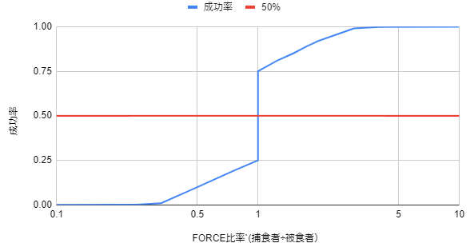

------------------------------------
・Absorb成功時の属性値上昇
------------------------------------
| 設定された確立をもとに、属性値一つずつについて抽選を行い、上昇値を決定する。
| 例：35％の確率で、吸収相手の属性値の25％の値を自身の値にプラス。

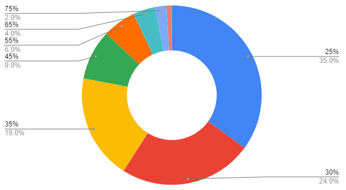

------------------------------------
・Absorb失敗時の能力値劣化
------------------------------------
| 設定された確立をもとに、属性値一つずつについて抽選を行い、劣化値を決定する。
| 例：80％の確率で、吸収相手の属性値の65％の値を自身の値にマイナス。

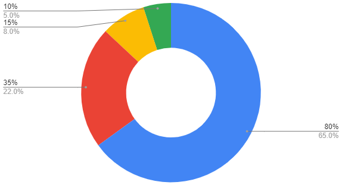

PERSONAの持つ属性値について::

        パラメーターとして以下の6つの属性値を持つ。
        属性値はAbsorbにより増減が発生する。
        また、Drawchain実行の条件として使用される。

            FOR (Force/エネルギー)
            ABS (Abyss/深淵)
            DFT (Determination/意思)
            MND (Mind/精神)
            INT (Intelligence/知識)
            EXP (Experience/経験値)

------------------------------------
吸収（Absorb）の実行
------------------------------------
| walletページの「食べる」からabsorbが実行できる。
| 対象のPERSONA、ARCANAを選択し、食べるを押下すると処理が実行される。

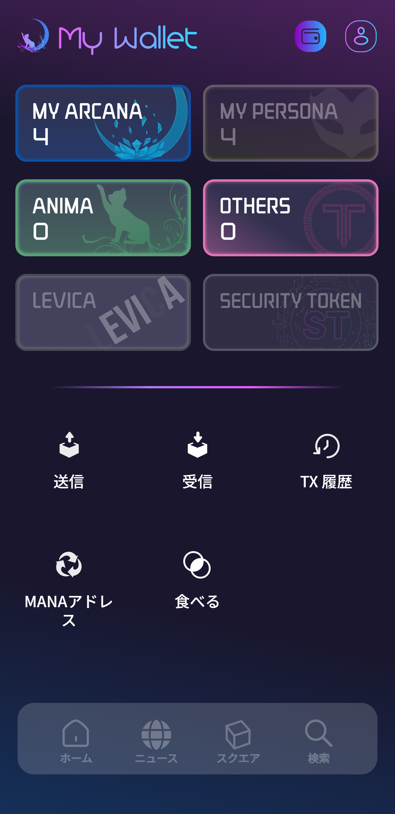
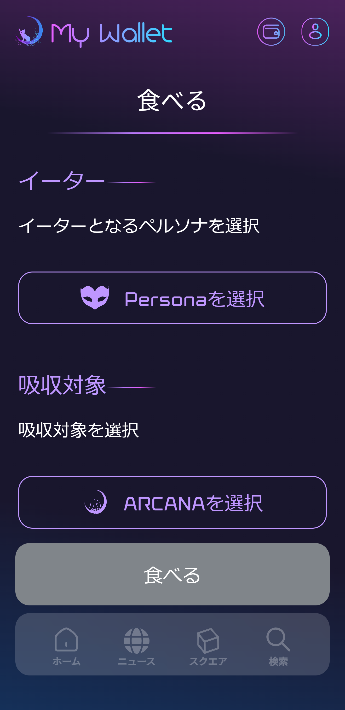
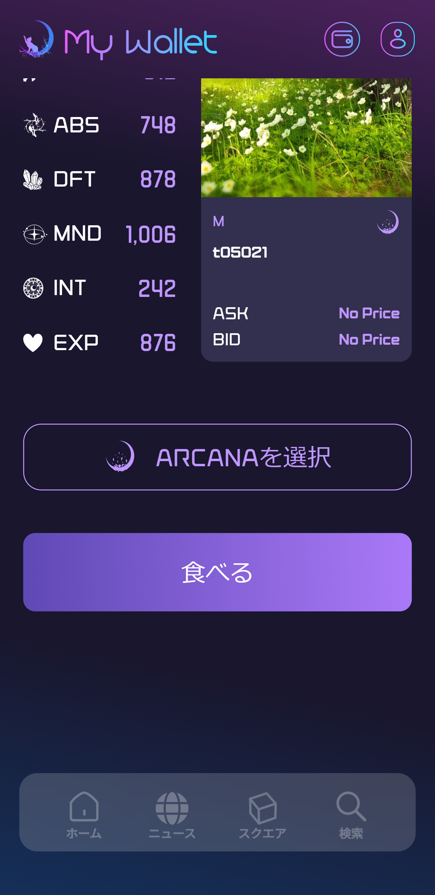

　|wallet_absorb|　|absorb_1|　|absorb_2|

■ユーザーが操作時に実行されるfunction

absorbの実行function(Persona.sol)::

        @param predetor 捕食者 (persona) トークンID
        @param prey 被食者（arcana）トークンID
        @return true: 捕食に成功した。 false: 捕食に失敗した。
        function absorb(uint256 predetor,uint256 prey) public returns (bool)

--------------------------------------------------------------------------------------------------------------------------------

Drawchainの実行
============================================

■UI

| Drawchainはスクエアを登録(フォロー)することが前提条件となる。
| その後Draw対象のDrawchainを選択し、自身の持つPERSONAを選択することによってDrawが実行できる。

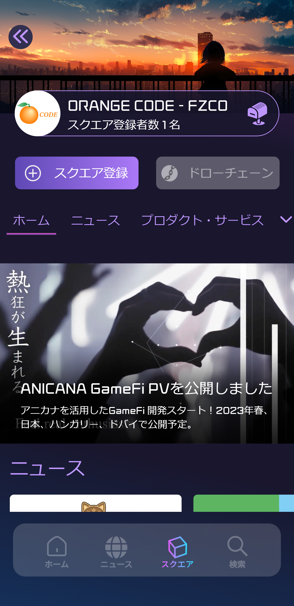
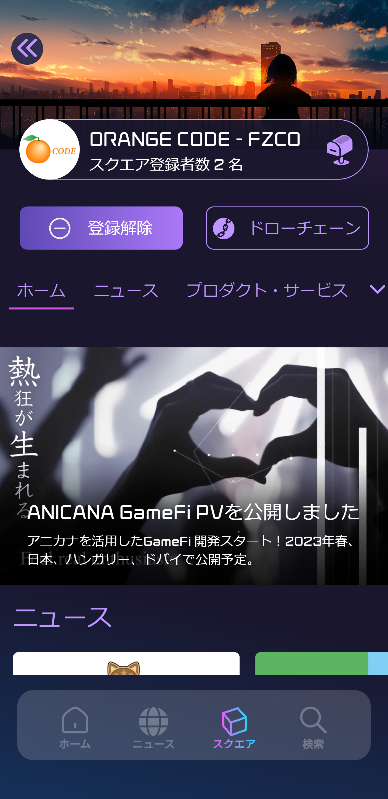
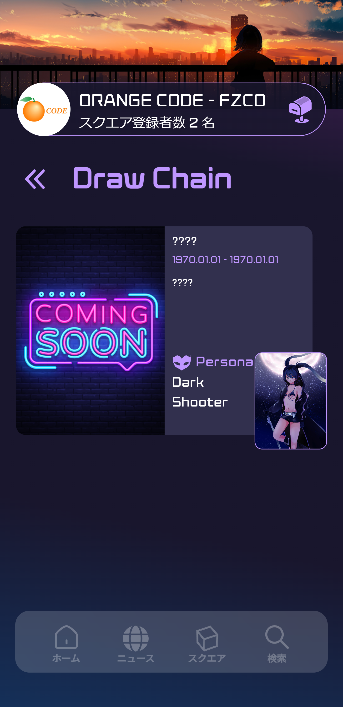
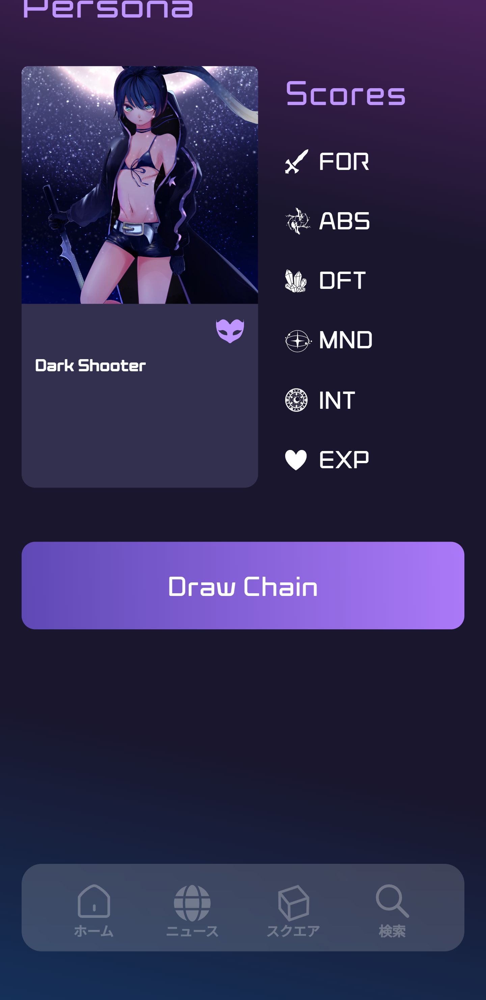
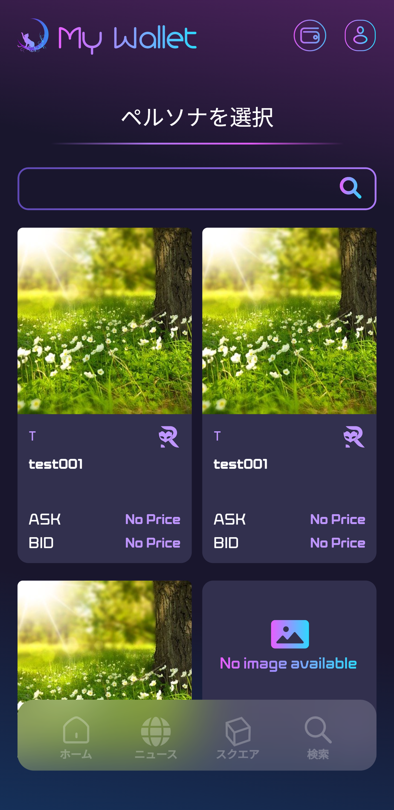
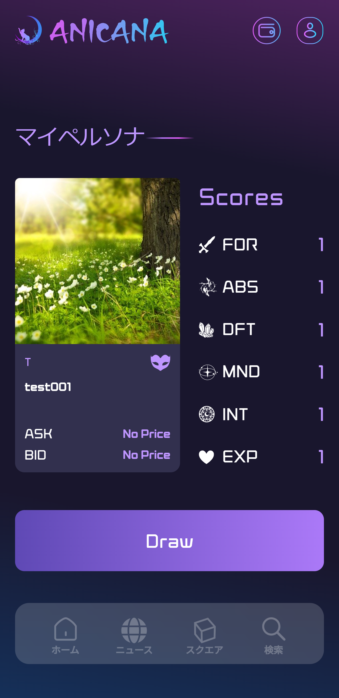

　|draw1|　|draw2|　|draw3|　|draw4|
　
　|draw5|　|draw6|

| ①DrawChainを引く
| コントラクト：Drawchain

| ■ユーザーが操作時に実行されるfunction

DrawChainを引くfunction(Drawchain.sol)::

        @param drawChainId DrawChain ID
        @param personaId Persona ID
        @return 0：draw失敗。 0以外：historyのindex
        function draw(uint256 drawChainId,uint256 personaId) public returns(uint256)

| ②景品を配布した際にdrawChain作成者に呼び出してもらう
| deliver(景品を配布した)したタイムスタンプを登録。

| ■パブリッシャー向けfunction

タイムスタンプを登録するfunction(Drawchain.sol)::

        @param historyId draw が成功した際に返す history Id
        function delivered(uint256 historyId)

------------------------------------
Drawchainの実行履歴
------------------------------------

■UI

walletページの「ドロー履歴」からユーザー自身のドロー履歴が確認できる。

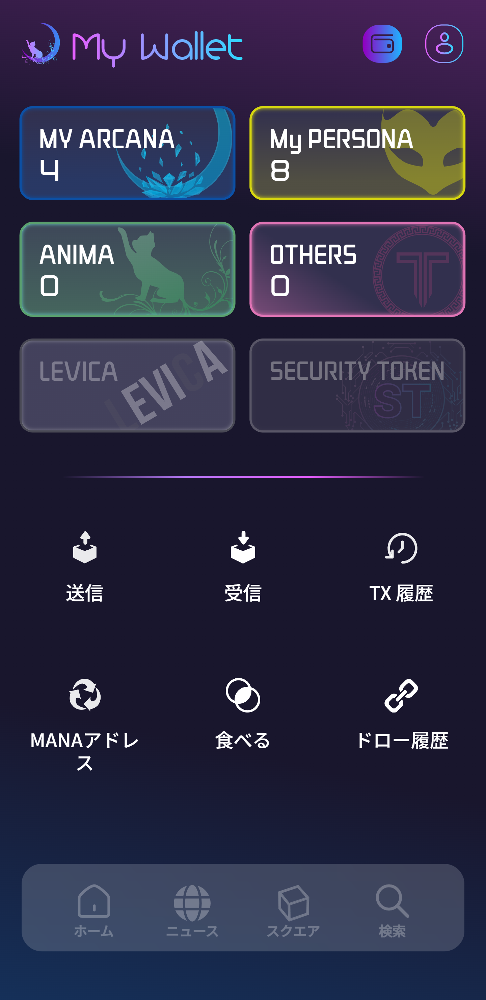
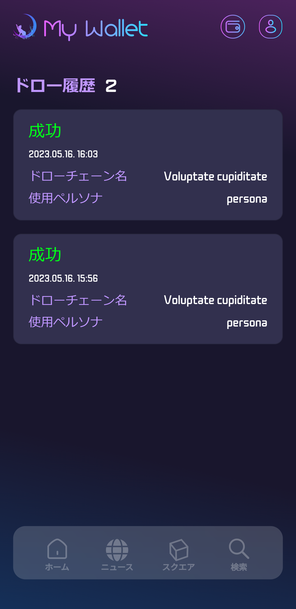

　|draw_hist_1|　|draw_hist_2|
