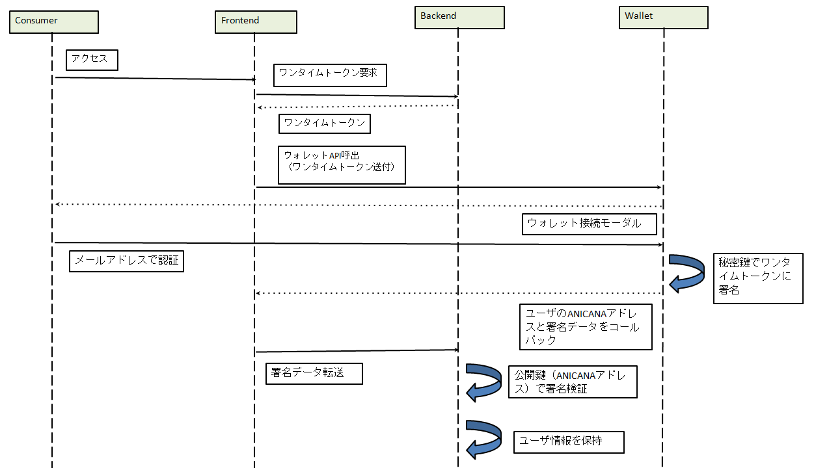

###########################
ウォレットの接続
###########################

ANICANAウォレットサーバを通じて、ゲームシステムからユーザのアドレスの取得およびその保有者であることの検証を行うことができる。
以下に一例の手順を示す。

Player: ゲームのユーザ

Frontend: ゲームのフロントエンド

Backend: ゲームのバックエンド

Wallet: ANICANAウォレットサーバ

------------------------------------------------------------------------------------------------------------------------------------------

API仕様
===========================

------------------------------------
ログインスクリプト
------------------------------------

環境情報は各環境情報ページを参照。

生成スクリプトサンプル::

    
    
<button class='' onclick='__open_portal_login()'>Login</button>

.. csv-table::
    :header-rows: 1
    :align: center

    パラメータ, 説明
    id, anikana_login_script (変更しないで下さい)
    src, {endpoint}//login.js
    data-call-id, ゲームメーカー毎に一意の数値。ゲーム側で、どの遷移からのユーザーが戻ってきたかなどを判別するための機能となっている。その情報が特に必要なければ9999999で問題ない。
    data-sign-text, 署名対象のテキスト(ワンタイムトークン)
    data-callback, コールバックURL. ログイン完了後、callId、 sign、 address (ユーザーのwallet address) がGETパラメータに追加されてリダイレクトされる。
    data-logout, true/false、または無し。trueの場合、強制的に再ログインをさせる。falseの場合、セッション情報があれば自動ログイン、なければ再ログインをさせる。無しの場合、falseと同様。

------------------------------------------------------------------------------------------------------------------------------------------

------------------------------------
ワンタイムトークン
------------------------------------

ウォレット側では、単に与えられた署名対象テキストを、ユーザの秘密鍵で署名して返す。
このときの署名方式は楕円曲線暗号方式(ECDSA)である。
この署名データの取り扱いは、利用側(ゲーム側)システムに委ねられる。

ログイン後のcallbackに送られてくるaddressの持ち主が本当に当該ユーザであるかを検証するには、この署名データの検証を行う。

署名されたデータと署名前のメッセージから、署名者addressが取得できるため、これをもって申告アドレスの本人確認とすることができる。

署名データの再利用を防ぐため、署名対象テキストは使い捨てにする方が望ましい。

署名作成例::

    var Web3 = require('web3');
    var web3 = new Web3("https://RPC_ENDPOINT");

    var original_message = "Hello world";
    var privateKey = "0xYOURPRIVATEKEYXXXXXXXXXXXXXXXXXXXXXXXXXXXXXXXXXXXXXXXXXXXX"
    var signedData = web3.eth.accounts.sign(original_message, privateKey);

signedDataの例::

    {
        message: 'Hello world',
        messageHash: '0x8144a6fa26be252b86456491fbcd43c1de7e022241845ffea1c3df066f7cfede',
        v: '0x1b',
        r: '0x399ab420d35d6d40e55580317b5fbb907942b6e35f56c22ddd306bd7b13aef8d',
        s: '0x4cedaa39073a5e626043228a20d2a386d9e0a80f5cafb90ac0798559b7b82d1d',
        signature: '0x399ab420d35d6d40e55580317b5fbb907942b6e35f56c22ddd306bd7b13aef8d4cedaa39073a5e626043228a20d2a386d9e0a80f5cafb90ac0798559b7b82d1d1b'
    }   
    // signatureが署名データ
    

検証例::

    var Web3 = require('web3');
    var web3 = new Web3("https://RPC_ENDPOINT");

    var original_message = "Hello world"
    var signature = "XXXXXXXXXXXXXXXXXXXX"   //Callbackされた署名データ
    var signer = web3.eth.accounts.recover(original_message, signature);
    
signerの例::

    0x7E99a37fFc1D9eCC05C9ac0c65598F8215c01582

