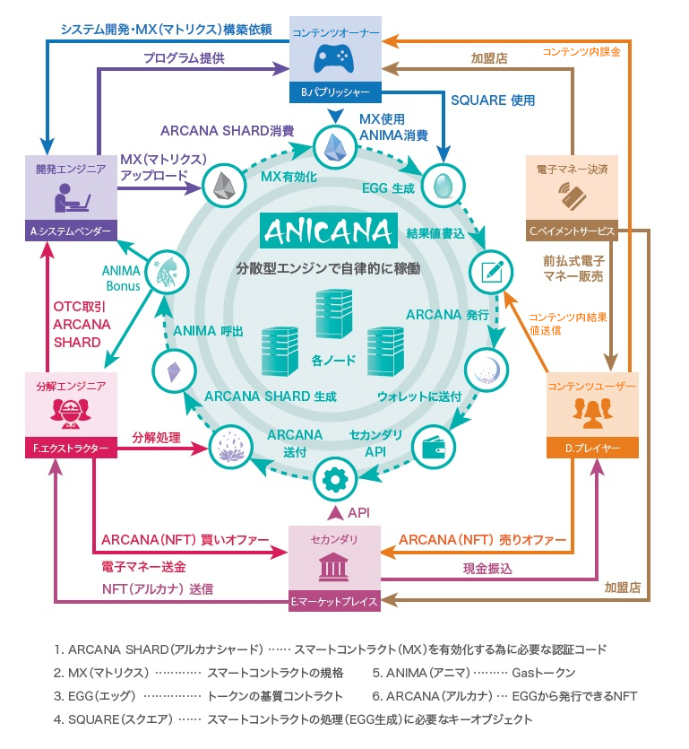

#######################################
ANICANA life cycle
#######################################

開発エンジニア / システムベンダーなど
============================================
主にANICANA上の各 Validator（コンテンツオーナー / パブリッシャー）に対して
ANICANA上で稼働するスマートコントラクトの規格であるMATRIX（以下「MATRIX」という。）の開発や各種認証に関するプログラム等の提供を行う。
開発エンジニアは、各コンテンツオーナー（パブリッシャー）から MATRIX の開発業務委託契約に基づき、スマートコントラクトをデザインし、
ANICANA上で ARCANA SHARD（ARCANAシャード）を消費して MATRIX をブロードキャストすることにより収益を獲得する。
また、循環構造のフローにおいて、所定のタスクにより発生するANIMAを受け取ることが可能になる。"

-----------------------------------------------------------------------------------------------------------------------------------------------------------------------------------------------

コンテンツオーナー / パブリッシャー（Validator）
==================================================
自社で用意したコンテンツとANICANAを連携させたコンテンツ（サービス）を展開できる。
コンテンツオーナーから提供された環境（インターフェース呼出）により、コンテンツを利用した結果を用いてANICANA上にARCANA（NFT）を生成することが可能となる。
また、コンテンツオーナーは、自社で定義する独自トークン（PERSONA）をユーザーに提供・販売することができる。
コンテンツオーナーは、コンテンツでの課金売上やPERSONAの販売等で収益を得ることができる。

-----------------------------------------------------------------------------------------------------------------------------------------------------------------------------------------------

ユーザー / コンテンツユーザー
============================================
前払式電子マネー等を購入してコンテンツに課金することができる。  
コンテンツを利用したユーザーは、コンテンツの結果値をANICANA上のエッグ（環境）に送信することで自身のARCANA（NFT）を生成することができる。
また、コンテンツオーナーが提供するトークン（PERSONA）を入手してPERSONAを育成したり、ARCANAやPERSONAの売却によって収益を得ることが可能となる。

-----------------------------------------------------------------------------------------------------------------------------------------------------------------------------------------------

セカンダリマーケットプレイス / マーケット運営事業者
=============================================================
ANICANA上の NFT やコンテンツに関するアイテムデータ等を売買できるサービスとなり、主にARCANAやPERSONAを取引する際に利用される。
売り手と買い手のオファーがマッチング（約定）した場合において、買い手から代金とトークンを受け取り、  入金があったことを確認して売り手に代金とトークンを送金する。

-----------------------------------------------------------------------------------------------------------------------------------------------------------------------------------------------

エクストラクター / 分解エンジニア
============================================
ARCANAに内在されている認証コード「ARCANA SHARD（ARCANAシャード）」を発掘する。
ARCANA SHARDを発掘する為に必要なARCANAを確保する為、セカンダリマーケットプレイスで売却されているARCANAに対して買い手となることが想定される。
ARCANA SHARDは開発エンジニアに対して需要が存在する為、分解エンジニアは開発エンジニアに対して発掘したARCANAシャードを売却することで 開発エンジニアからの業務委託による報酬を得ることができる。
また、開発エンジニアと同様に循環構造のフローにおいて、所定のタスクにより発生するANIMAを受け取ることができる。
