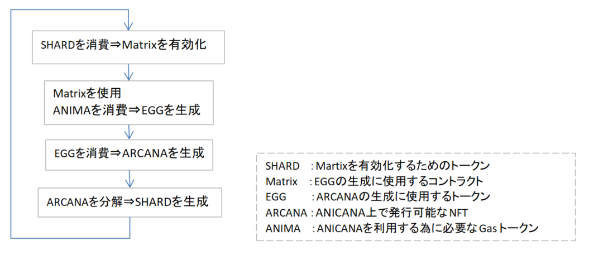

#######################################
ARCANA life cycle
#######################################

ARCANAライフサイクル
============================================
#. ARCANAトークンを生成する元となるEGGトークンは、Matrixコントラクトにより生成される。このMatrixコントラクトを有効化するために、SHARDを消費する。

#. 有効化したMatrixコントラクトを使用し、EGGトークンを生成する。EGGトークンを生成するために、ANIMAを消費する。

#. EGGを消費し、ARCANAを生成する。

#. 生成されたARCANAを分解することで、SHARDを生成することができる。

#. 生成されたSHARDは1.で使用する。