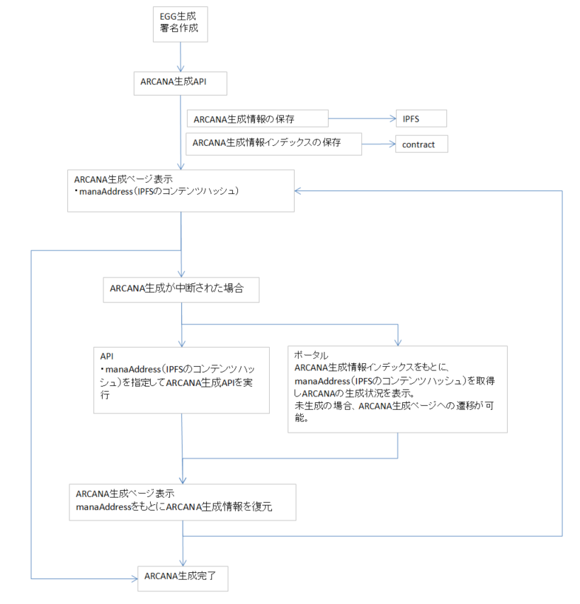

#######################################
ARCANA生成の仕組み
#######################################

ARCANA生成
============================================
| ユーザーがコンテンツをプレイした結果値を使用して、ARCANAを生成することができる。
| ARCANAはコンテンツオーナーが提供するトークン（PERSONA）の育成に使用したり、マーケットプレイスで売却が行える。
| ARCANA生成の機能を取り入れることで、コンテンツの報酬としてARCANA生成が行えるようになる。

生成の詳細は `こちら <../appendics/data-sign-text.html>`__ を参照。

生成情報の取得に関しては `こちら <../game-development/arcanaGeneratorInfo.html>`__ を参照。

-----------------------------------------------------------------------------------------------------------------------------------------------------------

ARCANA生成情報の保存(IPFS)
============================================

ARCANA生成情報がIPFSに保存される。
この情報をもとに、中断されたARCANA生成を再開することが可能。

--------------------------------------------------------------------------------------------------------------

ARCANA生成情報インデックスの保存(コントラクト)
===========================================================

IPFSのmana情報を取得するためのインデックスを保存。
