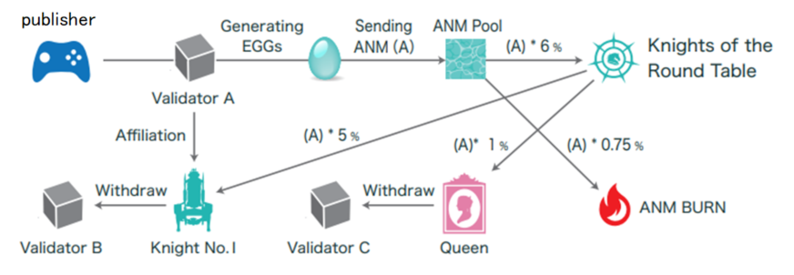

#######################################
Knights of the Round Table の役職
#######################################

役職
============================================
各Validatorは以下のいずれかの役職・属性を持つ。各役職の権限や選任手順の詳細はホワイトペーパーを参照。以下に概要を示す。

.. csv-table::
    :header-rows: 1
    :align: center

    "役職", "上限数", "権限", "コンセンサスへの参加", "EGG生成の可否"
    "Queen", "1", "Knightの指名", "有り", "可"
    "Knight", "12", "Validatorの参加承認", "有り", "可"
    "Pawns(または候補)", "209", "ー", "無し", "可"
    "未承認ノード", "無制限", "ー", "無し", "不可"

* Queen

Queenは、ANICANAに参加しているValidatorに対して、Knightの任命権とはく奪権を持つ。
Queenは、Validatorから自動的に一定割合のANMを受け取る。
Knightに任命された場合、そのValidatorにはKnightのNoが割り当てられる。KnightはQueenの任命に対して、拒否することはできない。
12名のKnightsから投票で選出され、任期は2年で再選は2回までとなる。

* Kinghts

Knightは、ANICANAに新規に参加したいValidatorに対して、参加の承認を与える権限を持つ。
12名のKnightsは、自身のNoに紐づけられたValidatorから生み出される一定数のANMをKnightの在籍期間中受け取ることができる。
新たなQueenが決定した場合、KnightはQueenにより新たに任命される。

* Pawns

Knightに任命されることにより、ANICANAに参加したノード、またはその候補。
参加承認は、Knight1名の承認で正式な参加承認となる。
新規に参加したValidatorは、参加を承認したKnightのNoが割り当てられる。

----------------------------------------------------------------------------------------------------------------------------------------------------------------------

Knights & Queen のANMの受け取り
============================================
Queen は、Validator から自動的に一定割合のANMを受け取る。
Knightは、自身に割り当てられているNoが承認したValidator（ゲームオーナー達）がシステムに対して支払ったGas（ANM）から、自動的に一定割合のANMを受け取る。

Queenの選挙
============================================
ブロックチェーンのコンセンサスへの参加が可能なのは、QueenとKnightの13ノードのみである。
新たなブロックの提案と承認はこれらのノードが行う。
役職は入れ替わることがあり、その都度コンセンサスへの参加ノードも合わせて入れ替わる。

* Queenの選挙

12名のKnightsから新たなQueenを選出する。
Queenの選挙に立候補という概念はなく、Knightが自身に対して投票することはできない。
Knightは最低6票を得ることにより、Queenに選出される。
選挙により最低得票数に満たない場合は、必要最低得票数を誰かが獲得するまで選挙を行うことになる。
Queenが不在の期間中は、Knights of the Round Tableで得られるKnightに対するANMの供給は行われず、得られるはずのANMが消失してしまうため、Queenの選出は早期に決定する必要がある。

* Queenの不信任案

Knightの3名以上の同意で、Queenの不信任案を提出することができる。
Knightは不信任案が提出された場合には、必ず“信任”もしくは“不信任”のどちらかに投票しなくてはならない。
9名の不信任でQueenを解任することができる。
不信任となりQueenを解任されたValidatorは一般Validatorになる。
新たなQueenが決定した場合、KnightはQueenにより新たに任命されるため、既存のKnightが再任される保証はない。
Knightに再任された場合でも、KnightのNo（席）が異なる場合には、その再任されたKnightのNo（席）に紐づいたANMが受け取れることになる。

Validator(候補)ノードの開放
=============================

Queen, Knight, Validatorの合計数の上限は決まっており、最大222個である。
最大数に到達するまでに、予め設計されたスケジュールで順次開放される。

.. csv-table::
    :header-rows: 1
    :align: center

    "開放時期", "個数", "累計"
    "2022", "30", "30"
    "2023", "100", "130"
    "2024", "50", "180"
    "2025", "25", "205"
    "2026", "12", "217"
    "2027", "5", "222"
