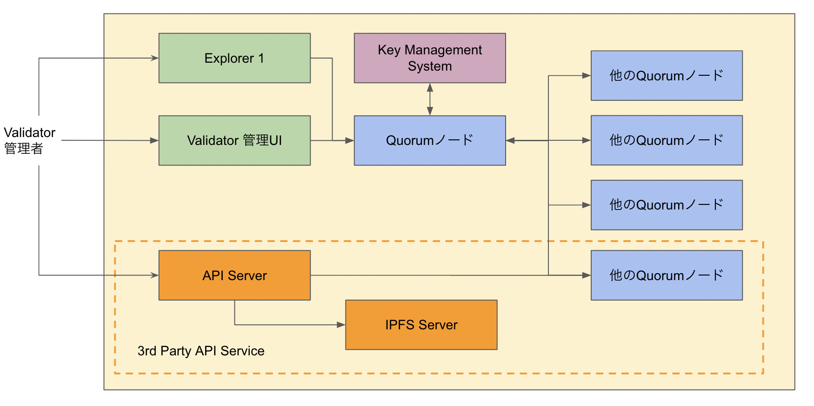

###########################
システム構成
###########################

1つのValidatorは以下の要素で構成されます。

.. csv-table::
    :header-rows: 1
    :align: center

    "要素", "説明"
    "Quorumノード", "ANICANAブロックチェーンノード本体"
    "Key Management System", "Validatorの秘密鍵を管理するシステム"
    "Validator管理UI", "このUIを通じてValidatorのノード管理や、EGG管理を行う"
    "Explorer", "ANICANAチェーン上のトランザクションを参照するUI"

--------------------------------------------------------------------------------

構成図
==============

    ANICANAコンソーシアムチェーン

