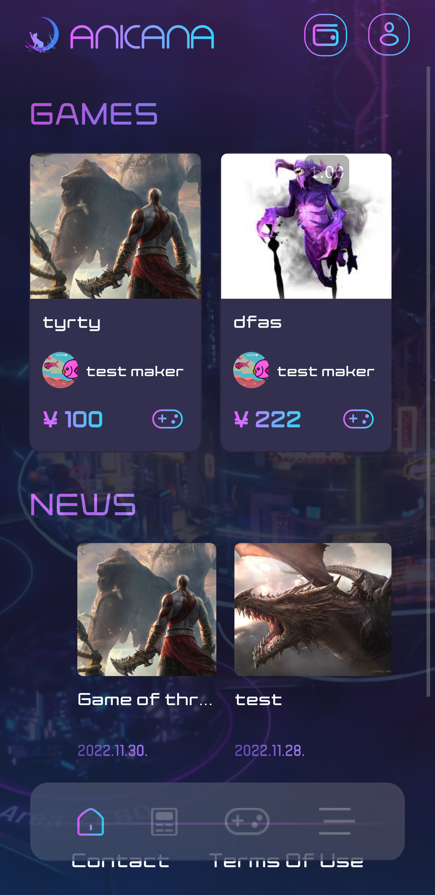
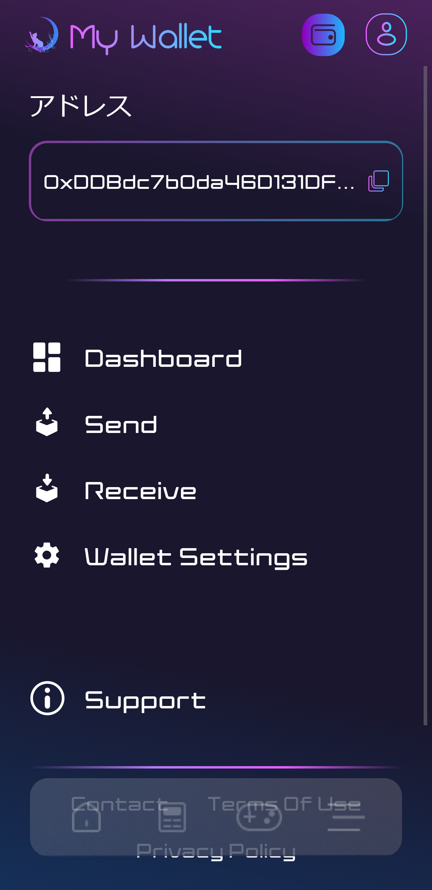
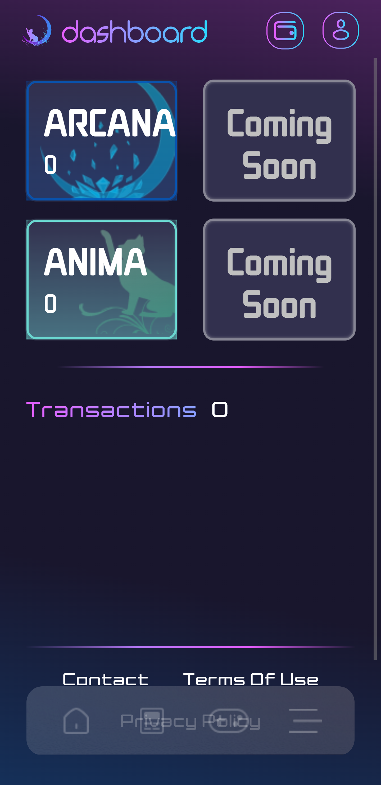

############################
アニカナウォレットに登録する
############################

Validatorが使う秘密鍵を生成するため、アニカナウォレット

アニカナポータルサイトがウォレットUIを提供しており、メールアドレスで認証を行うことでウォレットを生成できる。

- `アニカナポータルサイト(テスト環境) <https://staging.anicana.org/>`_
- `アニカナポータルサイト(本番環境) <https://anicana.org/>`_

--------------------------------------------------------------------------------------------------------------

ウォレット登録手順
============================

#. アニカナポータルサイトにて「sing up」を押下し、ユーザー登録を行う

   .. figure:: ../img/wallet-registration/1.png
      :scale: 10%

#. 利用規約、プライバシーポリシーに同意する

   .. figure:: ../img/wallet-registration/2.png
      :scale: 10%

#. プロフィール名を登録

   .. figure:: ../img/wallet-registration/3.png
      :scale: 10%

#. プロフィール画像を登録

   .. figure:: ../img/wallet-registration/4.png
      :scale: 10%

#. メールアドレスを登録

   .. figure:: ../img/wallet-registration/5.png
      :scale: 10%

#. 登録したメールアドレスに送信された認証コードを入力

   .. figure:: ../img/wallet-registration/6.png
      :scale: 10%

#. 電話番号を登録

   .. figure:: ../img/wallet-registration/7.png
      :scale: 10%

#. 登録した電話番号に送信された認証コードを入力

   .. figure:: ../img/wallet-registration/8.png
      :scale: 10%

#. パスワードを登録

   .. figure:: ../img/wallet-registration/9.png
      :scale: 10%

#. ユーザー登録が完了し、登録完了モーダルが表示される

   .. figure:: ../img/wallet-registration/10.png
      :scale: 10%

#. 登録した内容で「sign in」を行う

   .. figure:: ../img/wallet-registration/11.png
      :scale: 10%

#. ウォレット接続画面にて「connect」を押下

   .. figure:: ../img/wallet-registration/12.png
      :scale: 10%

#. メールアドレスを入力し、「Conection with Email」を押下

   .. figure:: ../img/wallet-registration/13.png
      :scale: 10%

#. ウォレット登録が完了。ウォレットページにてウォレットアドレスや、トークンの残高が確認できる。
   ウォレットページには右上左側のアイコンでアクセスできる。

　|logo1|　|logo2|　|logo3|

